# Mathematical Nexus (Python Notebooks)

This repository progressively ports legacy MATLAB demos from [`matlab/`](matlab/) into polished, standalone Python notebooks under [`python/`](python/).

Each notebook is designed to be educational: clear narrative, equations, visualizations, and interactive controls when useful.

## Notebook Gallery

| Topic | Visual snippet | Links |
|---|---|---|
| **AdaBoost** Builds a strong nonlinear classifier by iteratively combining weak separators. |  | Notebook: [`python/ada-boost/ada-boost.ipynb`](python/ada-boost/ada-boost.ipynb)  |
| **Advection** Simulates transport of a scalar field by a smooth velocity flow on a periodic grid. |  | Notebook: [`python/advection/advection.ipynb`](python/advection/advection.ipynb)  |
| **Alpha Shapes** Reconstructs multiscale geometry and boundaries from scattered planar point clouds. |  | Notebook: [`python/alpha-shapes/alpha-shapes.ipynb`](python/alpha-shapes/alpha-shapes.ipynb)  |
| **Apolonian Packing** Fills a shape using a greedy sequence of largest empty balls under different metrics. |  | Notebook: [`python/apolonian/apolonian.ipynb`](python/apolonian/apolonian.ipynb)  |
| **Approximation** Compares linear Fourier truncation and sparsity-based nonlinear approximation of images. |  | Notebook: [`python/approximation/approximation.ipynb`](python/approximation/approximation.ipynb)  |
| **Arithmetico-Geometric Mean** Visualizes convergence of arithmetic and geometric means as a 2D dynamical process. | [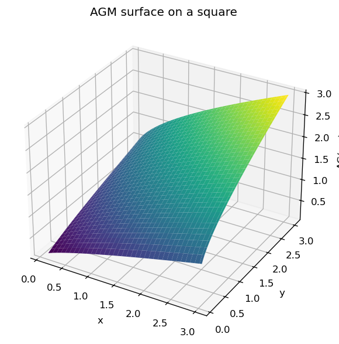](python/arithmetico-geometric/arithmetico-geometric.ipynb) | Notebook: [`python/arithmetico-geometric/arithmetico-geometric.ipynb`](python/arithmetico-geometric/arithmetico-geometric.ipynb)  |
| **Autoregressive Dynamics** Studies AR(2) trajectories, oscillations, and correlation decay in the complex plane. | [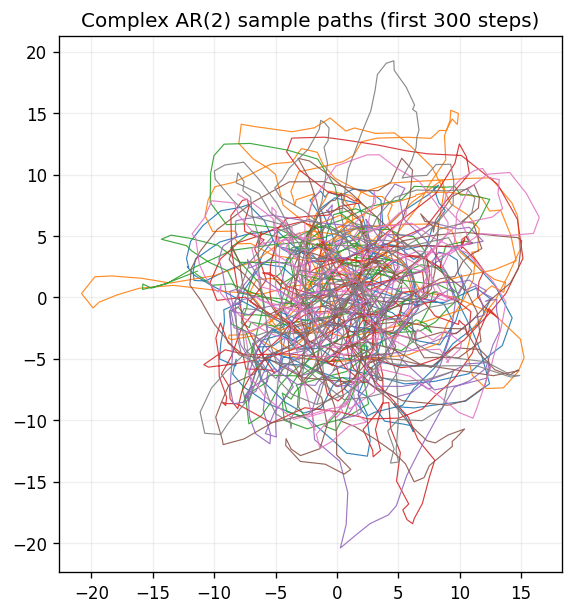](python/autoregressive/autoregressive.ipynb) | Notebook: [`python/autoregressive/autoregressive.ipynb`](python/autoregressive/autoregressive.ipynb)  |
| **Backprojection Radon** Builds tomographic reconstructions from sinograms with filtered backprojection. | [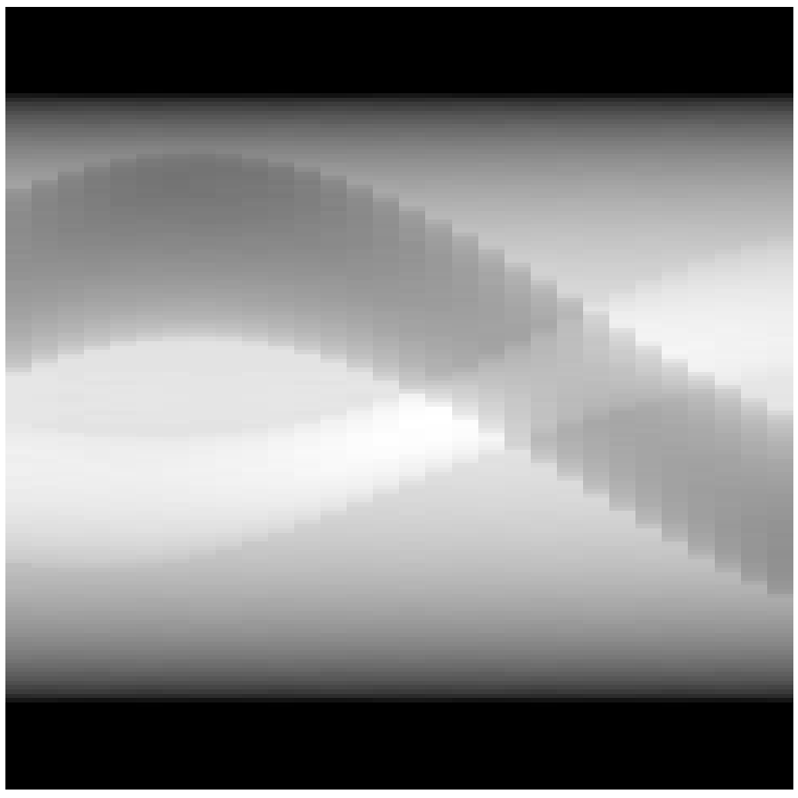](python/backprojection-radon/backprojection-radon.ipynb) | Notebook: [`python/backprojection-radon/backprojection-radon.ipynb`](python/backprojection-radon/backprojection-radon.ipynb)  |
| **Bayesian Posterior** Shows how prior and likelihood interact to shape posterior uncertainty and mode shifts. | [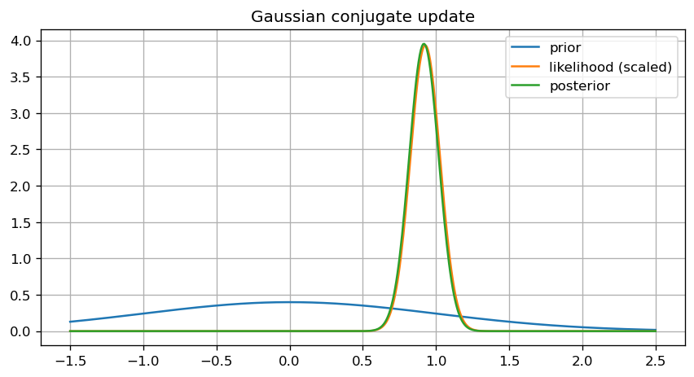](python/bayesian/bayesian.ipynb) | Notebook: [`python/bayesian/bayesian.ipynb`](python/bayesian/bayesian.ipynb)  |
| **Bernouilli TCL** Illustrates central-limit behavior through repeated convolution of discrete laws. | [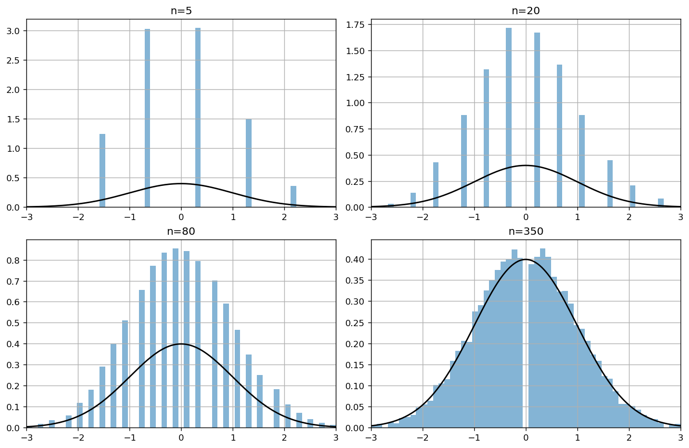](python/bernouilli-tcl/bernouilli-tcl.ipynb) | Notebook: [`python/bernouilli-tcl/bernouilli-tcl.ipynb`](python/bernouilli-tcl/bernouilli-tcl.ipynb)  |
| **Bifurcation** Explores period-doubling and chaos in iterated logistic dynamics. | [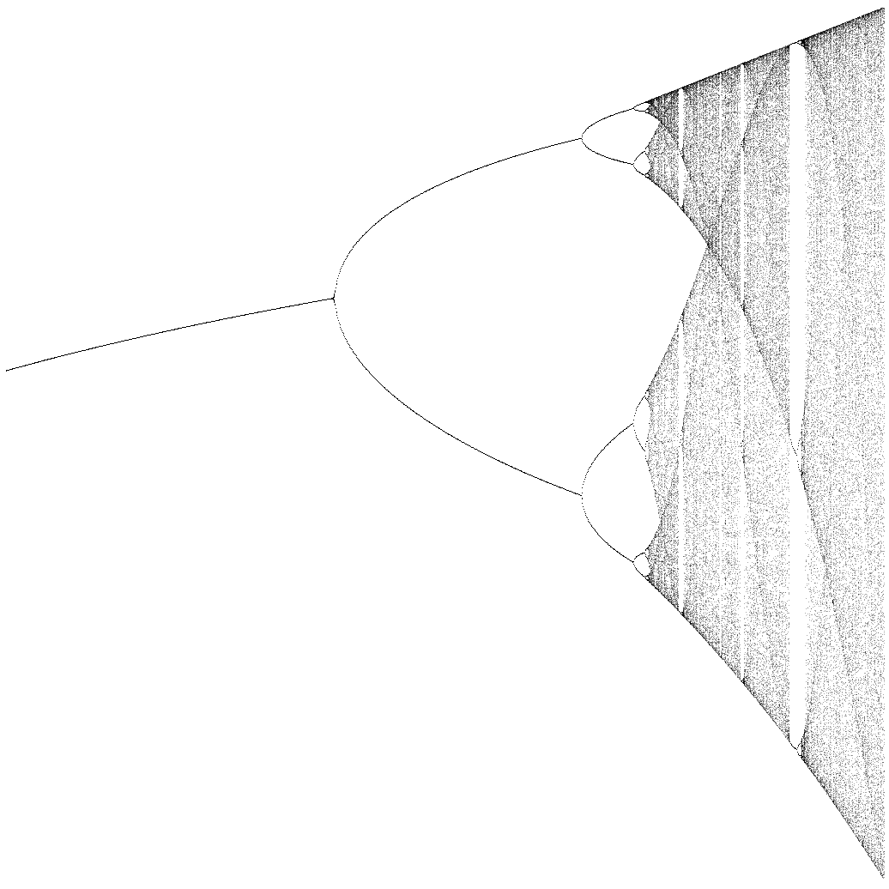](python/bifurcation/bifurcation.ipynb) | Notebook: [`python/bifurcation/bifurcation.ipynb`](python/bifurcation/bifurcation.ipynb)  |
| **Bilateral Filtering** Demonstrates edge-preserving denoising via joint spatial and radiometric kernels. | [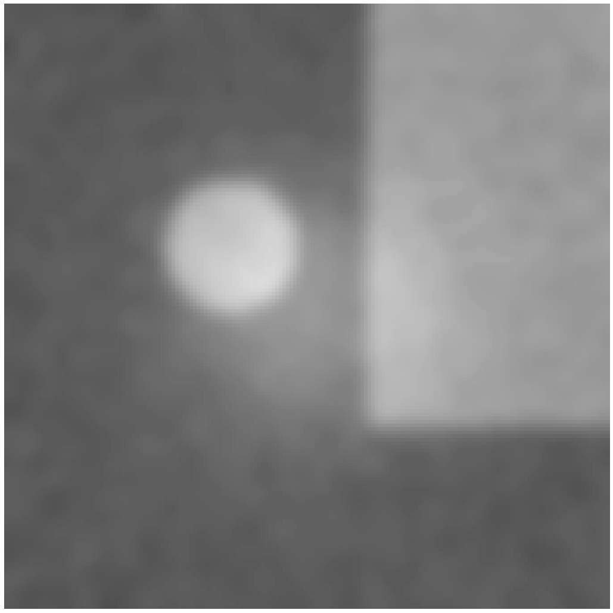](python/bilateral-filtering/bilateral-filtering.ipynb) | Notebook: [`python/bilateral-filtering/bilateral-filtering.ipynb`](python/bilateral-filtering/bilateral-filtering.ipynb)  |
| **Boltzmann Particles** Simulates elastic particle collisions to reveal emergent mixing behavior. | [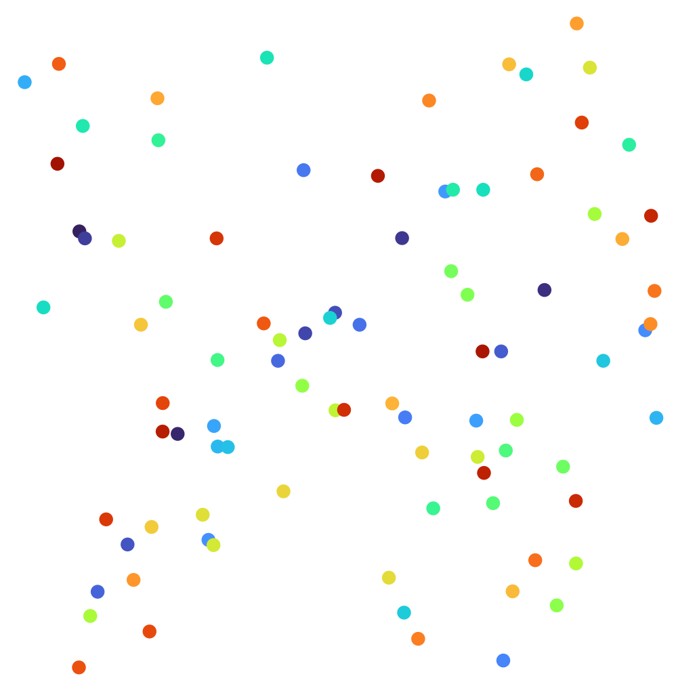](python/boltzmann/boltzmann.ipynb) | Notebook: [`python/boltzmann/boltzmann.ipynb`](python/boltzmann/boltzmann.ipynb)  |
| **Brachistochrone** Compares descent times across curve families in a classical variational problem. | [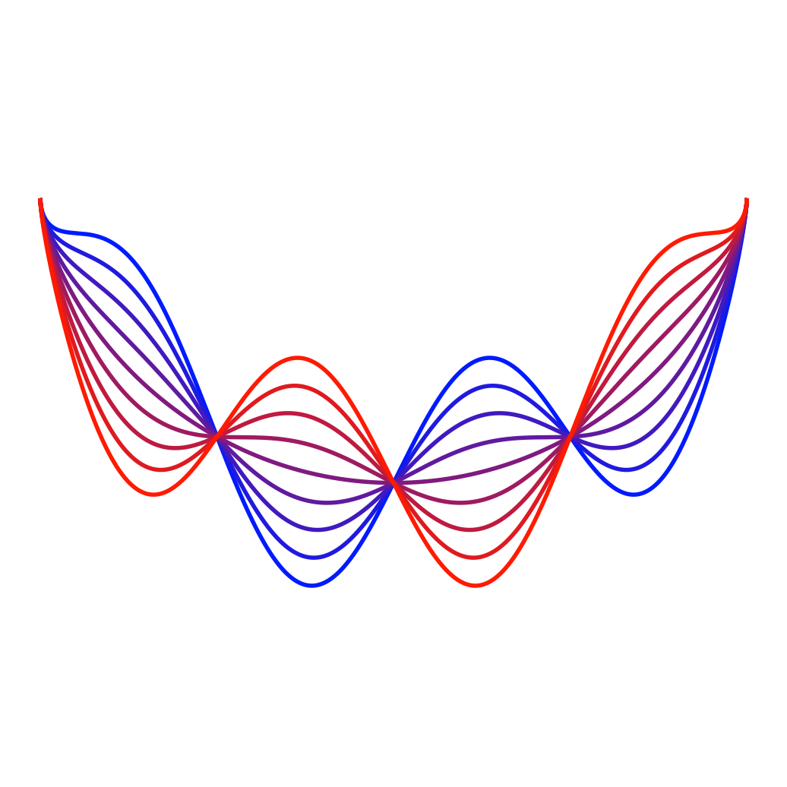](python/brachistochrone/brachistochrone.ipynb) | Notebook: [`python/brachistochrone/brachistochrone.ipynb`](python/brachistochrone/brachistochrone.ipynb)  |
| **Bregman Flow** Visualizes the family of α-divergences and mirror-descent trajectories on a Hessian manifold. | [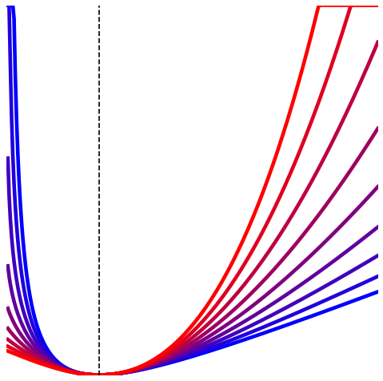](python/bregman-flow/bregman-flow.ipynb) | Notebook: [`python/bregman-flow/bregman-flow.ipynb`](python/bregman-flow/bregman-flow.ipynb)  |
| **Brownian Motion** Constructs Brownian paths from random walks, studies quadratic variation, and visualizes Brownian bridges. | [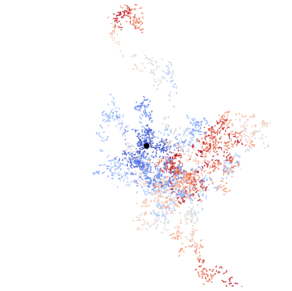](python/brownian/brownian.ipynb) | Notebook: [`python/brownian/brownian.ipynb`](python/brownian/brownian.ipynb)  |
| **Burgers Equation** Simulates shock formation and viscous regularization in a nonlinear transport-diffusion PDE. | [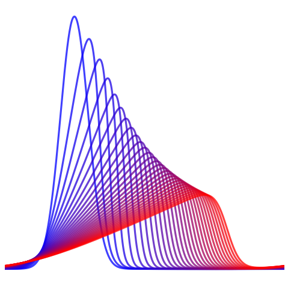](python/burgers/burgers.ipynb) | Notebook: [`python/burgers/burgers.ipynb`](python/burgers/burgers.ipynb)  |
| **Cellular Automata** Explores Wolfram's 256 elementary rules and Conway's Game of Life on 1D and 2D grids. | [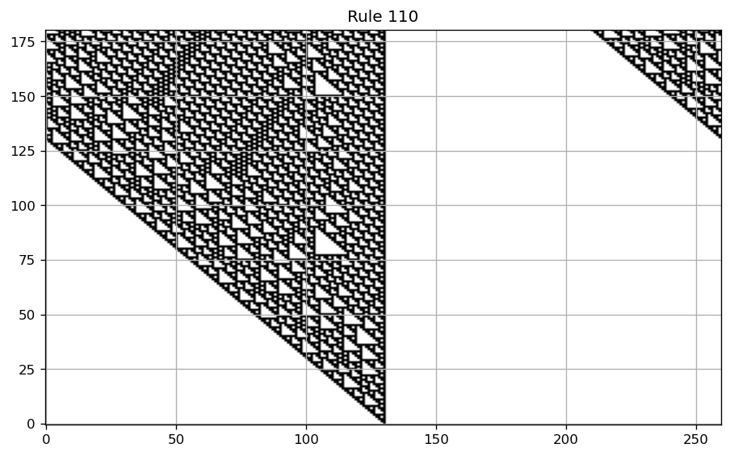](python/cellular/cellular.ipynb) | Notebook: [`python/cellular/cellular.ipynb`](python/cellular/cellular.ipynb)  |
| **Conjugate Gradient** Visualizes Krylov subspace search paths and the effect of condition number on convergence speed. | [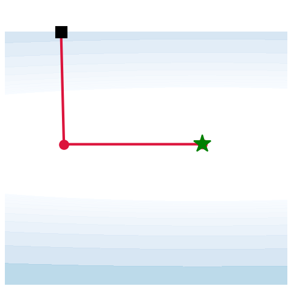](python/conjugate-gradient/conjugate-gradient.ipynb) | Notebook: [`python/conjugate-gradient/conjugate-gradient.ipynb`](python/conjugate-gradient/conjugate-gradient.ipynb)  |
| **De Casteljau / Bézier** Constructs Bézier curves via the De Casteljau triangular scheme and demonstrates subdivision. | [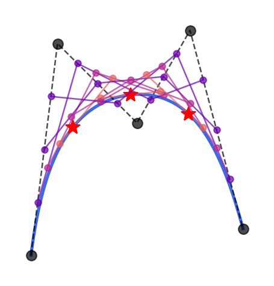](python/de-casteljau/de-casteljau.ipynb) | Notebook: [`python/de-casteljau/de-casteljau.ipynb`](python/de-casteljau/de-casteljau.ipynb)  |
| **Dijkstra** Computes shortest paths on weighted grid graphs and visualizes wavefront expansion through heterogeneous terrain. | [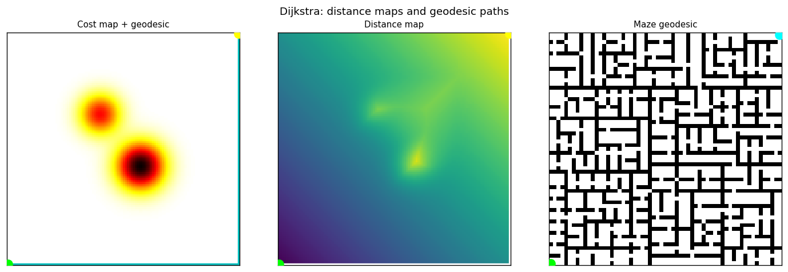](python/dijkstra/dijkstra.ipynb) | Notebook: [`python/dijkstra/dijkstra.ipynb`](python/dijkstra/dijkstra.ipynb)  |
| **DTW** Aligns time series via dynamic programming warping paths and contrasts elastic vs Euclidean similarity. | [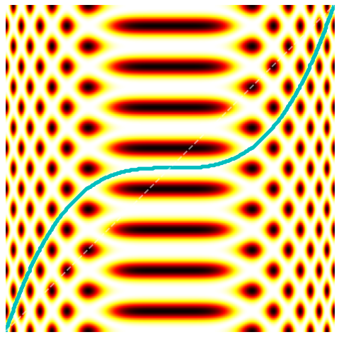](python/dtw/dtw.ipynb) | Notebook: [`python/dtw/dtw.ipynb`](python/dtw/dtw.ipynb)  |
| **Dykstra** Compares alternating projections (POCS) and Dykstra's algorithm for finding the closest point in an intersection of convex sets. | [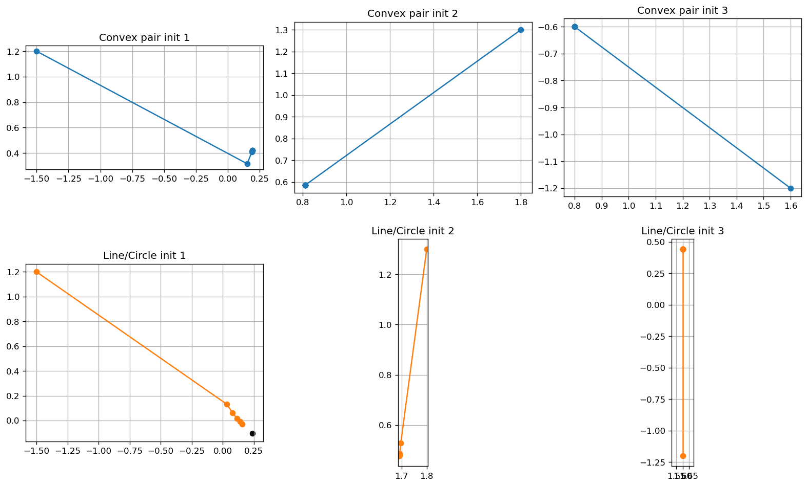](python/dykstra/dykstra.ipynb) | Notebook: [`python/dykstra/dykstra.ipynb`](python/dykstra/dykstra.ipynb)  |
| **Edge Detection** Implements gradient, Laplacian zero-crossing, and Canny detectors across a Gaussian scale-space. | [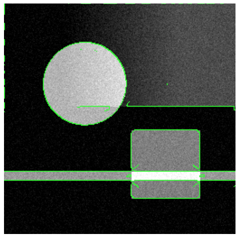](python/edge-detection/edge-detection.ipynb) | Notebook: [`python/edge-detection/edge-detection.ipynb`](python/edge-detection/edge-detection.ipynb)  |
| **Error Diffusion** Halftones continuous-tone images using Floyd–Steinberg error diffusion and contrasts Bayer and random dithering. | [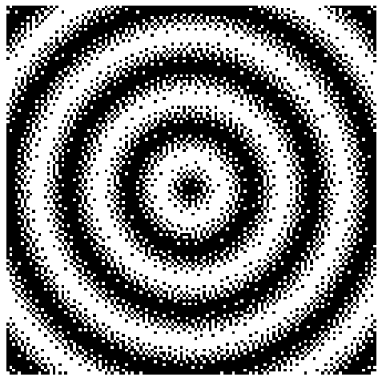](python/error-diffusion/error-diffusion.ipynb) | Notebook: [`python/error-diffusion/error-diffusion.ipynb`](python/error-diffusion/error-diffusion.ipynb)  |
| **Extreme Values** Explores the GEV family (Gumbel, Fréchet, Weibull), block-maxima convergence, and return-level estimation. | [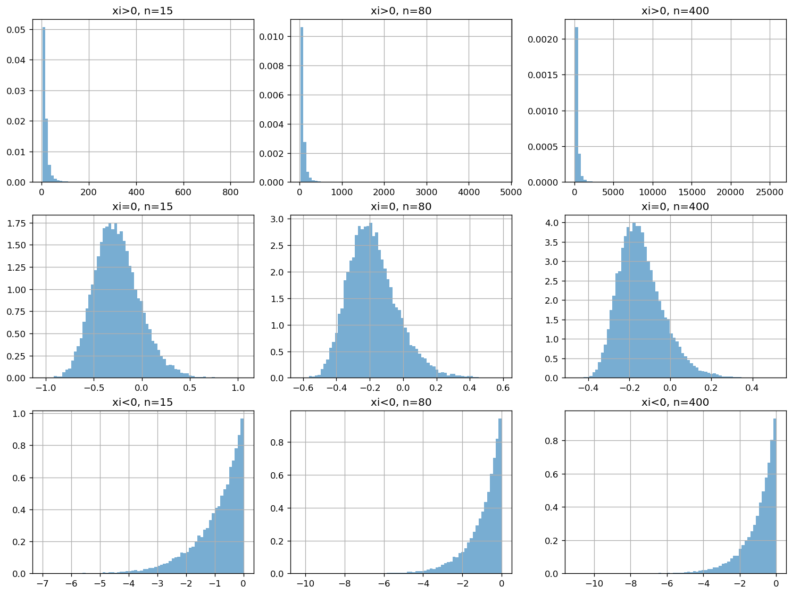](python/extreme-values/extreme-values.ipynb) | Notebook: [`python/extreme-values/extreme-values.ipynb`](python/extreme-values/extreme-values.ipynb)  |
| **Farthest-Point Sampling** Builds well-spread point sets via a greedy covering algorithm and visualizes the evolving Voronoi diagram. | [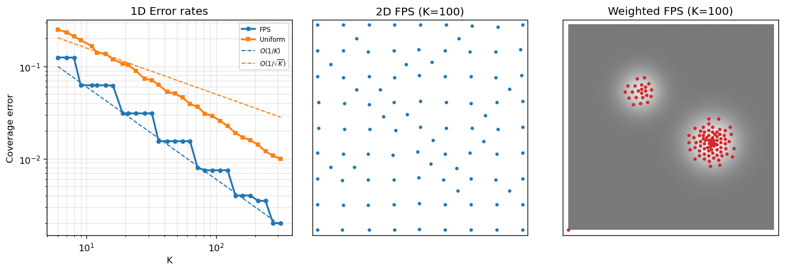](python/farthest-point/farthest-point.ipynb) | Notebook: [`python/farthest-point/farthest-point.ipynb`](python/farthest-point/farthest-point.ipynb)  |
| **Fixed-Point Iterations** Visualizes cobweb diagrams, Banach's theorem, and convergence rates for one-dimensional contractions. | [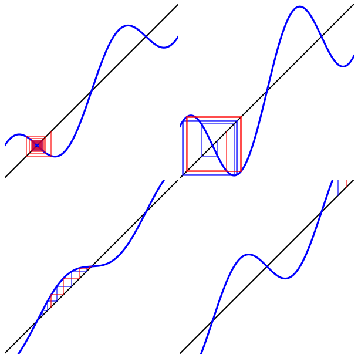](python/fixed-point/fixed-point.ipynb) | Notebook: [`python/fixed-point/fixed-point.ipynb`](python/fixed-point/fixed-point.ipynb)  |
| **Flocking** Simulates the Cucker–Smale model of emergent velocity consensus in a multi-agent particle system. | [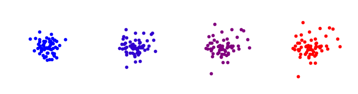](python/flocking/flocking.ipynb) | Notebook: [`python/flocking/flocking.ipynb`](python/flocking/flocking.ipynb)  |

## Notes

- Notebooks are standalone and do not depend on `matlab/toolbox/`.
- Main Python dependencies: `numpy`, `matplotlib`, `scipy`, and `ipywidgets`.
