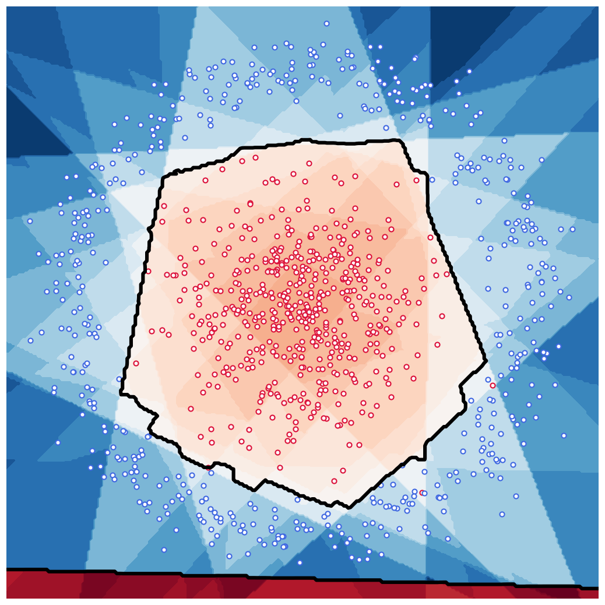
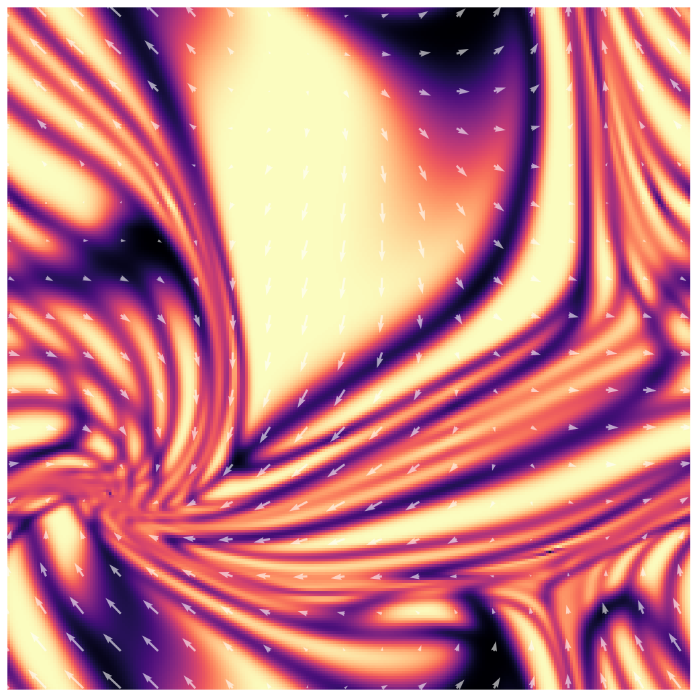
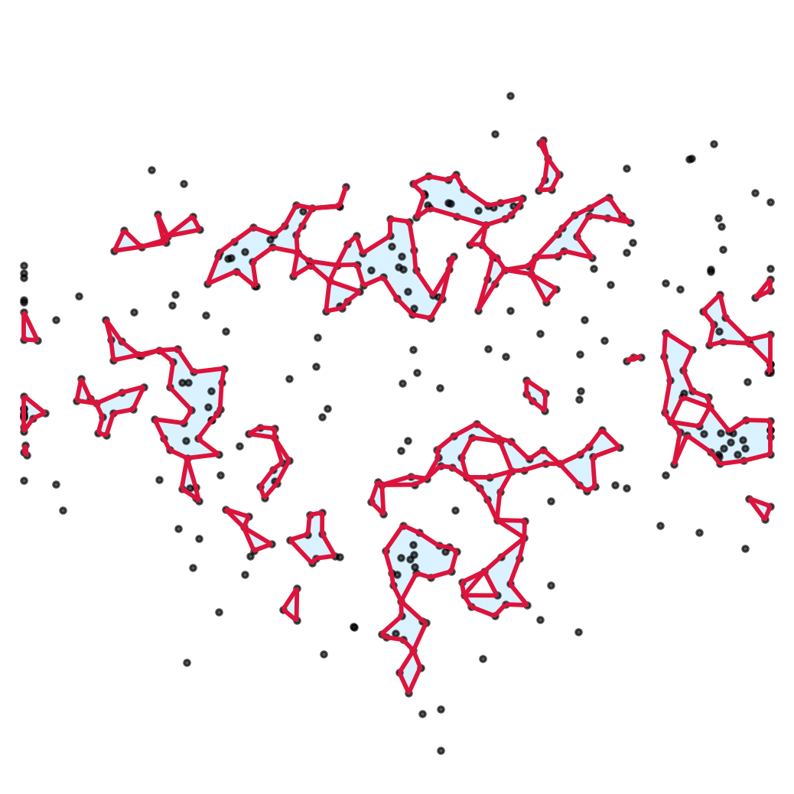
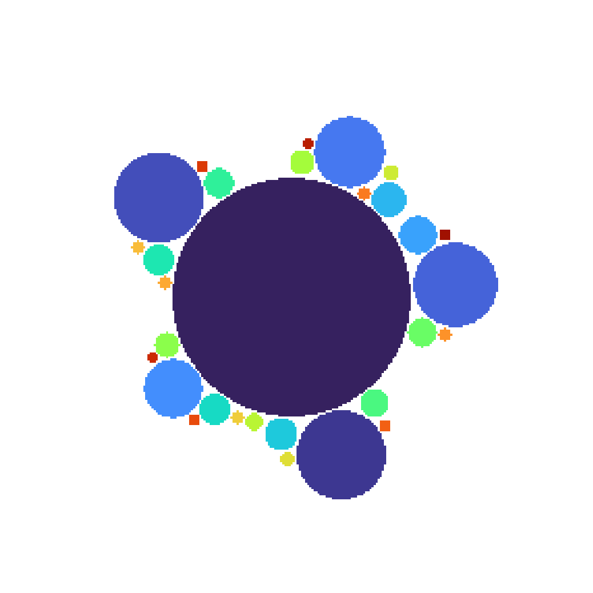

# Mathematical Nexus (Python Notebooks)

This repository progressively ports legacy MATLAB demos from [`matlab/`](matlab/) into polished, standalone Python notebooks under [`python/`](python/).

Each notebook is designed to be educational: clear narrative, equations, visualizations, and interactive controls when useful.

## Notebook Gallery

| Topic | Visual snippet | Links |
|---|---|---|
| **AdaBoost** |  | Notebook: [`python/ada-boost/ada-boost.ipynb`](python/ada-boost/ada-boost.ipynb) MATLAB: [`matlab/ada-boost/AdaBoost.m`](matlab/ada-boost/AdaBoost.m)  |
| **Advection** |  | Notebook: [`python/advection/advection.ipynb`](python/advection/advection.ipynb) MATLAB: [`matlab/advection/Advection.m`](matlab/advection/Advection.m)  |
| **Alpha Shapes** |  | Notebook: [`python/alpha-shapes/alpha-shapes.ipynb`](python/alpha-shapes/alpha-shapes.ipynb) MATLAB: [`matlab/alpha-shapes/AlphaShapes.m`](matlab/alpha-shapes/AlphaShapes.m)  |
| **Apolonian Packing** |  | Notebook: [`python/apolonian/apolonian.ipynb`](python/apolonian/apolonian.ipynb) MATLAB: [`matlab/apolonian/Apolonian.m`](matlab/apolonian/Apolonian.m)  |

## Notes

- Notebooks are standalone and do not depend on `matlab/toolbox/`.
- Main Python dependencies: `numpy`, `matplotlib`, `scipy`, and `ipywidgets`.
