# Mathematical Nexus

This repository is a visual and computational atlas of mathematical ideas, where each notebook combines intuition, rigorous formulas, numerical experiments, and interactive exploration to make concepts concrete and reproducible.

## Unified Search Browser

Browse the full collection (notebooks + vignettes) from the root catalog page: [`index.html`](index.html).
The catalog data is generated from [`database.xlsx`](database.xlsx) using:

```bash
python3 scripts/build_catalog_database.py
```

### GitHub Pages (Simple Branch Deployment)

This repository is intended to be published without GitHub Actions:
- `Settings → Pages`
- `Source: Deploy from a branch`
- `Branch: main`
- `Folder: /(root)`

Before pushing updates, regenerate the catalog:

```bash
python3 scripts/build_catalog_database.py
```

## Notebook Gallery

|  |  |  |
|---|---|---|
| **AdaBoost**<br>Builds a strong nonlinear classifier by iteratively combining weak separators. | [](python/ada-boost/ada-boost.ipynb) | [](https://colab.research.google.com/github/gpeyre/mathematical-nexus/blob/main/python/ada-boost/ada-boost.ipynb) |
| **Advection**<br>Simulates transport of a scalar field by a smooth velocity flow on a periodic grid. | [](python/advection/advection.ipynb) | [](https://colab.research.google.com/github/gpeyre/mathematical-nexus/blob/main/python/advection/advection.ipynb) |
| **Alpha Shapes**<br>Reconstructs multiscale geometry and boundaries from scattered planar point clouds. | [](python/alpha-shapes/alpha-shapes.ipynb) | [](https://colab.research.google.com/github/gpeyre/mathematical-nexus/blob/main/python/alpha-shapes/alpha-shapes.ipynb) |
| **Apolonian Packing**<br>Fills a shape using a greedy sequence of largest empty balls under different metrics. | [](python/apolonian/apolonian.ipynb) | [](https://colab.research.google.com/github/gpeyre/mathematical-nexus/blob/main/python/apolonian/apolonian.ipynb) |
| **Approximation**<br>Compares linear Fourier truncation and sparsity-based nonlinear approximation of images. | [](python/approximation/approximation.ipynb) | [](https://colab.research.google.com/github/gpeyre/mathematical-nexus/blob/main/python/approximation/approximation.ipynb) |
| **Arithmetico-Geometric Mean**<br>Visualizes convergence of arithmetic and geometric means as a 2D dynamical process. | [](python/arithmetico-geometric/arithmetico-geometric.ipynb) | [](https://colab.research.google.com/github/gpeyre/mathematical-nexus/blob/main/python/arithmetico-geometric/arithmetico-geometric.ipynb) |
| **Autoregressive Dynamics**<br>Studies AR(2) trajectories, oscillations, and correlation decay in the complex plane. | [](python/autoregressive/autoregressive.ipynb) | [](https://colab.research.google.com/github/gpeyre/mathematical-nexus/blob/main/python/autoregressive/autoregressive.ipynb) |
| **Backprojection Radon**<br>Builds tomographic reconstructions from sinograms with filtered backprojection. | [](python/backprojection-radon/backprojection-radon.ipynb) | [](https://colab.research.google.com/github/gpeyre/mathematical-nexus/blob/main/python/backprojection-radon/backprojection-radon.ipynb) |
| **Bayesian Posterior**<br>Shows how prior and likelihood interact to shape posterior uncertainty and mode shifts. | [](python/bayesian/bayesian.ipynb) | [](https://colab.research.google.com/github/gpeyre/mathematical-nexus/blob/main/python/bayesian/bayesian.ipynb) |
| **Bernouilli TCL**<br>Illustrates central-limit behavior through repeated convolution of discrete laws. | [](python/bernouilli-tcl/bernouilli-tcl.ipynb) | [](https://colab.research.google.com/github/gpeyre/mathematical-nexus/blob/main/python/bernouilli-tcl/bernouilli-tcl.ipynb) |
| **Bifurcation**<br>Explores period-doubling and chaos in iterated logistic dynamics. | [](python/bifurcation/bifurcation.ipynb) | [](https://colab.research.google.com/github/gpeyre/mathematical-nexus/blob/main/python/bifurcation/bifurcation.ipynb) |
| **Bilateral Filtering**<br>Demonstrates edge-preserving denoising via joint spatial and radiometric kernels. | [](python/bilateral-filtering/bilateral-filtering.ipynb) | [](https://colab.research.google.com/github/gpeyre/mathematical-nexus/blob/main/python/bilateral-filtering/bilateral-filtering.ipynb) |
| **Boltzmann Particles**<br>Simulates elastic particle collisions to reveal emergent mixing behavior. | [](python/boltzmann/boltzmann.ipynb) | [](https://colab.research.google.com/github/gpeyre/mathematical-nexus/blob/main/python/boltzmann/boltzmann.ipynb) |
| **Brachistochrone**<br>Compares descent times across curve families in a classical variational problem. | [](python/brachistochrone/brachistochrone.ipynb) | [](https://colab.research.google.com/github/gpeyre/mathematical-nexus/blob/main/python/brachistochrone/brachistochrone.ipynb) |
| **Bregman Flow**<br>Visualizes the family of α-divergences and mirror-descent trajectories on a Hessian manifold. | [](python/bregman-flow/bregman-flow.ipynb) | [](https://colab.research.google.com/github/gpeyre/mathematical-nexus/blob/main/python/bregman-flow/bregman-flow.ipynb) |
| **Brownian Motion**<br>Constructs Brownian paths from random walks, studies quadratic variation, and visualizes Brownian bridges. | [](python/brownian/brownian.ipynb) | [](https://colab.research.google.com/github/gpeyre/mathematical-nexus/blob/main/python/brownian/brownian.ipynb) |
| **Burgers Equation**<br>Simulates shock formation and viscous regularization in a nonlinear transport-diffusion PDE. | [](python/burgers/burgers.ipynb) | [](https://colab.research.google.com/github/gpeyre/mathematical-nexus/blob/main/python/burgers/burgers.ipynb) |
| **Cellular Automata**<br>Explores Wolfram's 256 elementary rules and Conway's Game of Life on 1D and 2D grids. | [](python/cellular/cellular.ipynb) | [](https://colab.research.google.com/github/gpeyre/mathematical-nexus/blob/main/python/cellular/cellular.ipynb) |
| **Conjugate Gradient**<br>Visualizes Krylov subspace search paths and the effect of condition number on convergence speed. | [](python/conjugate-gradient/conjugate-gradient.ipynb) | [](https://colab.research.google.com/github/gpeyre/mathematical-nexus/blob/main/python/conjugate-gradient/conjugate-gradient.ipynb) |
| **De Casteljau / Bézier**<br>Constructs Bézier curves via the De Casteljau triangular scheme and demonstrates subdivision. | [](python/de-casteljau/de-casteljau.ipynb) | [](https://colab.research.google.com/github/gpeyre/mathematical-nexus/blob/main/python/de-casteljau/de-casteljau.ipynb) |
| **Dijkstra**<br>Computes shortest paths on weighted grid graphs and visualizes wavefront expansion through heterogeneous terrain. | [](python/dijkstra/dijkstra.ipynb) | [](https://colab.research.google.com/github/gpeyre/mathematical-nexus/blob/main/python/dijkstra/dijkstra.ipynb) |
| **DTW**<br>Aligns time series via dynamic programming warping paths and contrasts elastic vs Euclidean similarity. | [](python/dtw/dtw.ipynb) | [](https://colab.research.google.com/github/gpeyre/mathematical-nexus/blob/main/python/dtw/dtw.ipynb) |
| **Dykstra**<br>Compares alternating projections (POCS) and Dykstra's algorithm for finding the closest point in an intersection of convex sets. | [](python/dykstra/dykstra.ipynb) | [](https://colab.research.google.com/github/gpeyre/mathematical-nexus/blob/main/python/dykstra/dykstra.ipynb) |
| **Edge Detection**<br>Implements gradient, Laplacian zero-crossing, and Canny detectors across a Gaussian scale-space. | [](python/edge-detection/edge-detection.ipynb) | [](https://colab.research.google.com/github/gpeyre/mathematical-nexus/blob/main/python/edge-detection/edge-detection.ipynb) |
| **Error Diffusion**<br>Halftones continuous-tone images using Floyd–Steinberg error diffusion and contrasts Bayer and random dithering. | [](python/error-diffusion/error-diffusion.ipynb) | [](https://colab.research.google.com/github/gpeyre/mathematical-nexus/blob/main/python/error-diffusion/error-diffusion.ipynb) |
| **Extreme Values**<br>Explores the GEV family (Gumbel, Fréchet, Weibull), block-maxima convergence, and return-level estimation. | [](python/extreme-values/extreme-values.ipynb) | [](https://colab.research.google.com/github/gpeyre/mathematical-nexus/blob/main/python/extreme-values/extreme-values.ipynb) |
| **Farthest-Point Sampling**<br>Builds well-spread point sets via a greedy covering algorithm and visualizes the evolving Voronoi diagram. | [](python/farthest-point/farthest-point.ipynb) | [](https://colab.research.google.com/github/gpeyre/mathematical-nexus/blob/main/python/farthest-point/farthest-point.ipynb) |
| **Fixed-Point Iterations**<br>Visualizes cobweb diagrams, Banach's theorem, and convergence rates for one-dimensional contractions. | [](python/fixed-point/fixed-point.ipynb) | [](https://colab.research.google.com/github/gpeyre/mathematical-nexus/blob/main/python/fixed-point/fixed-point.ipynb) |
| **Flocking**<br>Simulates the Cucker–Smale model of emergent velocity consensus in a multi-agent particle system. | [](python/flocking/flocking.ipynb) | [](https://colab.research.google.com/github/gpeyre/mathematical-nexus/blob/main/python/flocking/flocking.ipynb) |
| **Floyd–Warshall**<br>Computes all-pairs shortest paths via dynamic programming and visualizes the tropical algebra structure. | [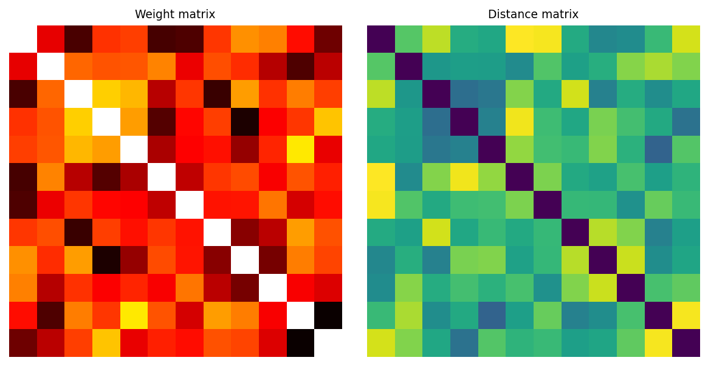](python/floyd-warshall/floyd-warshall.ipynb) | [](https://colab.research.google.com/github/gpeyre/mathematical-nexus/blob/main/python/floyd-warshall/floyd-warshall.ipynb) |
| **Fluids**<br>Solves the 2D incompressible Navier–Stokes equations with a Fourier spectral method and semi-Lagrangian advection. | [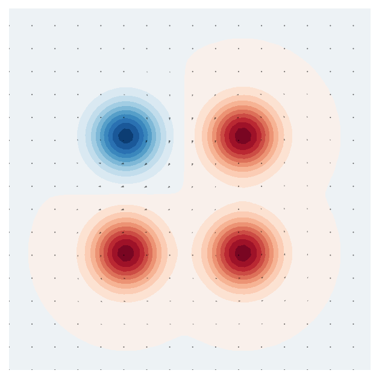](python/fluids/fluids.ipynb) | [](https://colab.research.google.com/github/gpeyre/mathematical-nexus/blob/main/python/fluids/fluids.ipynb) |
| **Fourier Atoms**<br>Explores 1D and 2D Fourier atoms, the DFT matrix, and Gram-matrix orthogonality of sinusoidal bases. | [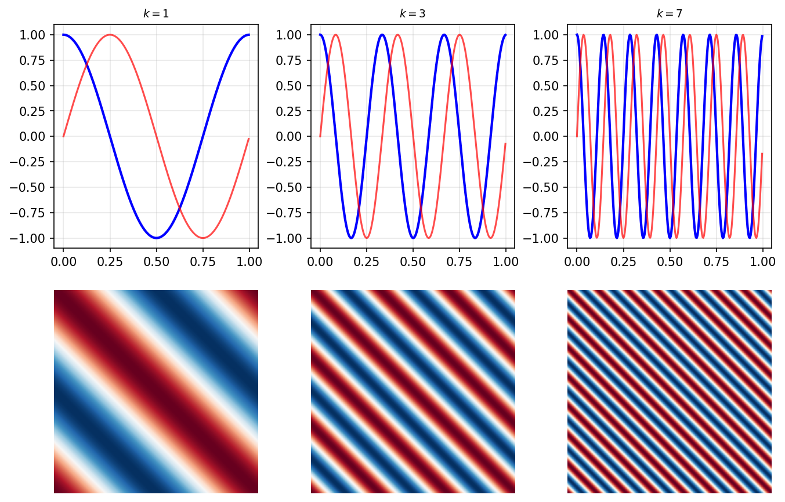](python/fourier-atoms/fourier-atoms.ipynb) | [](https://colab.research.google.com/github/gpeyre/mathematical-nexus/blob/main/python/fourier-atoms/fourier-atoms.ipynb) |
| **Fourier Cristal**<br>Generates crystallographic and quasicrystalline interference patterns from $K$-fold symmetric plane waves. | [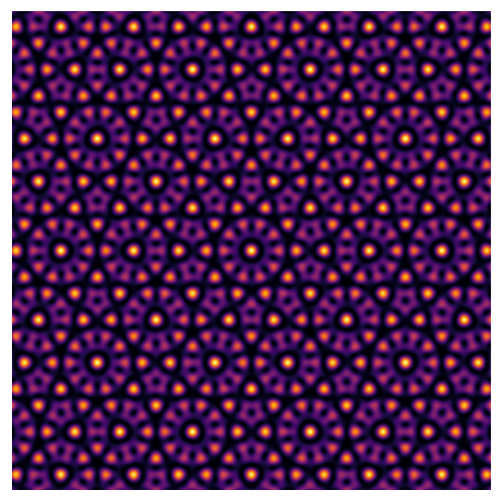](python/fourier-cristal/fourier-cristal.ipynb) | [](https://colab.research.google.com/github/gpeyre/mathematical-nexus/blob/main/python/fourier-cristal/fourier-cristal.ipynb) |
| **Fourier Curves**<br>Approximates closed planar curves with bandlimited Fourier descriptors and sweeps the bandwidth interactively. | [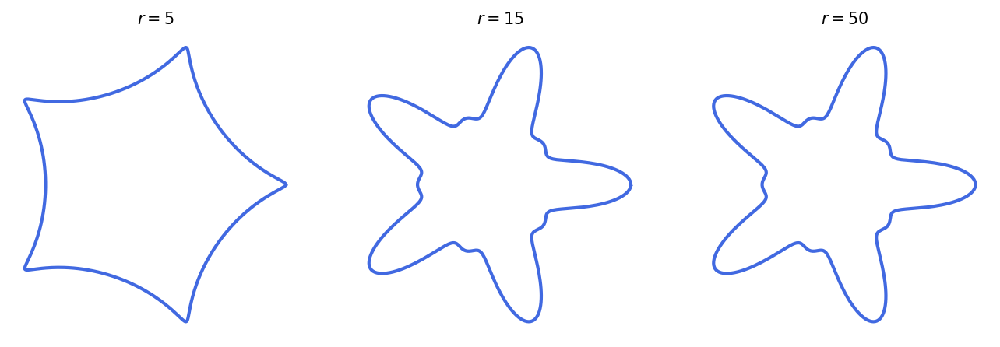](python/fourier-curves/fourier-curves.ipynb) | [](https://colab.research.google.com/github/gpeyre/mathematical-nexus/blob/main/python/fourier-curves/fourier-curves.ipynb) |
| **Fourier Matrix**<br>Visualizes the DFT matrix, proves the convolution theorem, and benchmarks Cooley–Tukey FFT vs naive DFT. | [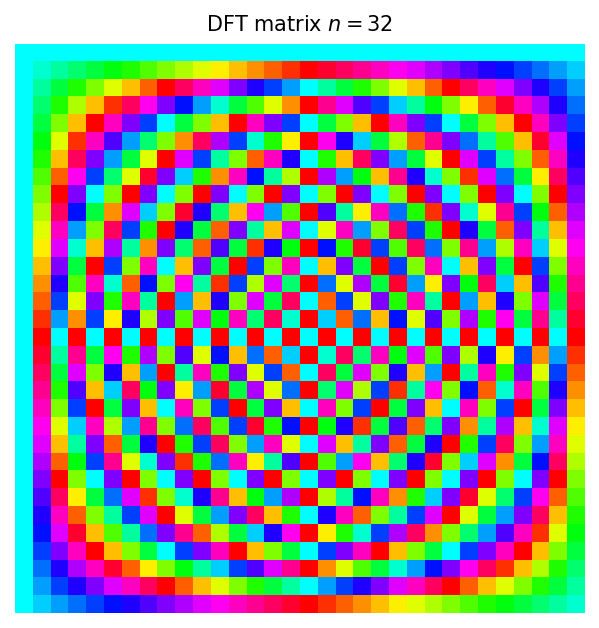](python/fourier-matrix/fourier-matrix.ipynb) | [](https://colab.research.google.com/github/gpeyre/mathematical-nexus/blob/main/python/fourier-matrix/fourier-matrix.ipynb) |
| **Fourier Signal**<br>Studies convergence rates of Fourier partial sums for signals of varying regularity in 1D and 2D. | [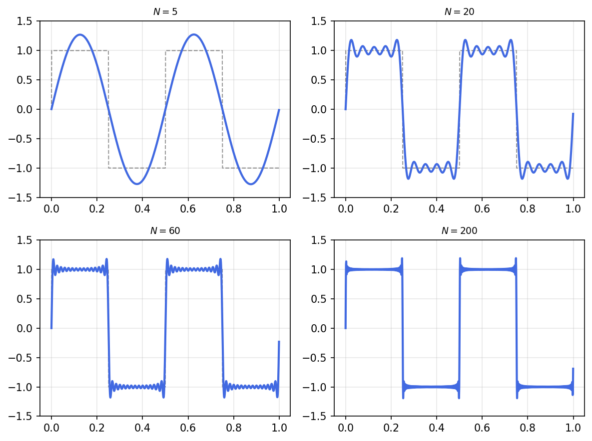](python/fourier-signal/fourier-signal.ipynb) | [](https://colab.research.google.com/github/gpeyre/mathematical-nexus/blob/main/python/fourier-signal/fourier-signal.ipynb) |
| **Foveation**<br>Simulates spatially-varying Gaussian blur mimicking the foveal acuity falloff of the human retina. | [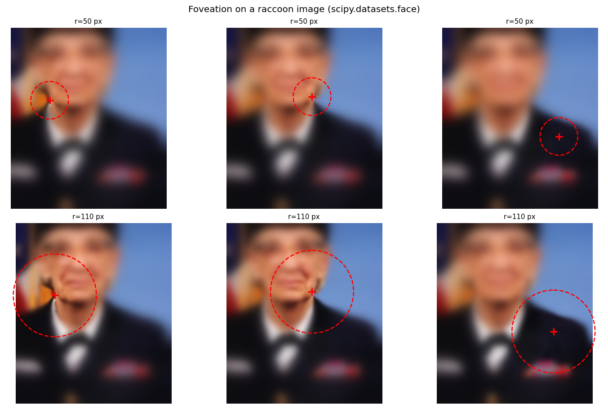](python/foveation/foveation.ipynb) | [](https://colab.research.google.com/github/gpeyre/mathematical-nexus/blob/main/python/foveation/foveation.ipynb) |
| **Fractional Derivatives**<br>Applies the Fourier definition of fractional derivatives to a Gaussian and sweeps the order $\alpha \in [0,4]$. | [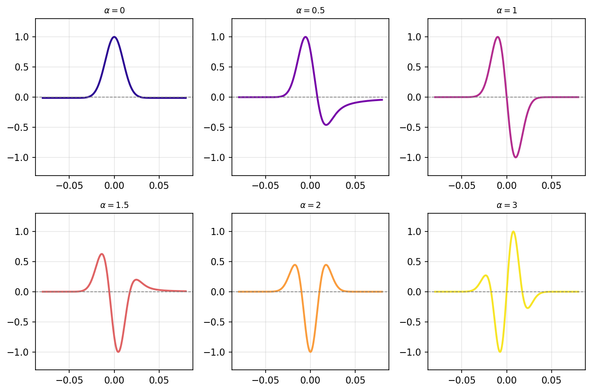](python/frac-der-gaussian/frac-der-gaussian.ipynb) | [](https://colab.research.google.com/github/gpeyre/mathematical-nexus/blob/main/python/frac-der-gaussian/frac-der-gaussian.ipynb) |
| **Fractional Laplacian**<br>Explores the nonlocal operator $(-\Delta)^s$ via its Fourier multiplier, anomalous diffusion, and Lévy-flight tails. | [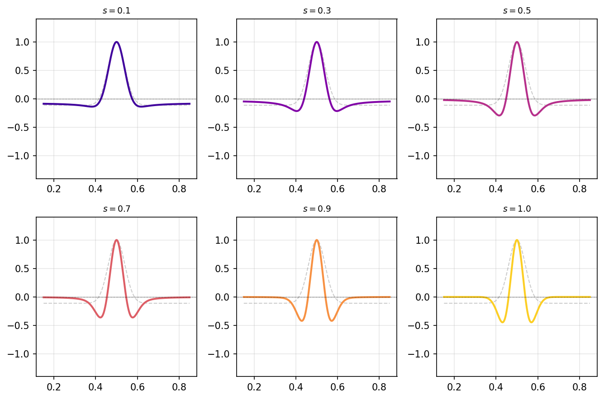](python/fractional-laplacian/fractional-laplacian.ipynb) | [](https://colab.research.google.com/github/gpeyre/mathematical-nexus/blob/main/python/fractional-laplacian/fractional-laplacian.ipynb) |
| **Frank–Wolfe**<br>Implements the projection-free Frank–Wolfe algorithm on polytopes and visualizes the sparse iterate trajectory. | [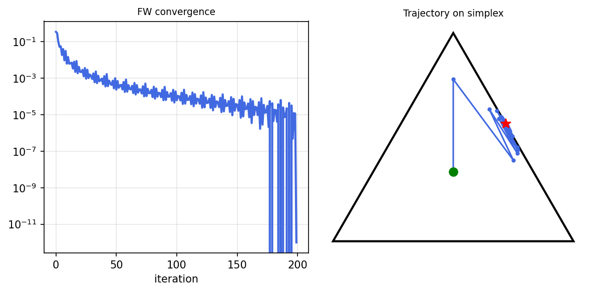](python/frank-wolfe/frank-wolfe.ipynb) | [](https://colab.research.google.com/github/gpeyre/mathematical-nexus/blob/main/python/frank-wolfe/frank-wolfe.ipynb) |
| **Continued Fractions**<br>Computes convergents via the Euclidean algorithm, verifies best-approximation and the Gauss–Kuzmin distribution. | [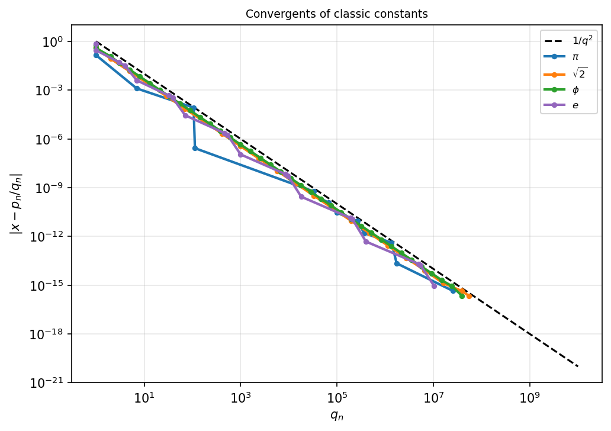](python/fraction-continued/fraction-continued.ipynb) | [](https://colab.research.google.com/github/gpeyre/mathematical-nexus/blob/main/python/fraction-continued/fraction-continued.ipynb) |
| **Game Theory**<br>Solves two-player zero-sum matrix games with the Chambolle–Pock primal-dual algorithm and fictitious play. | [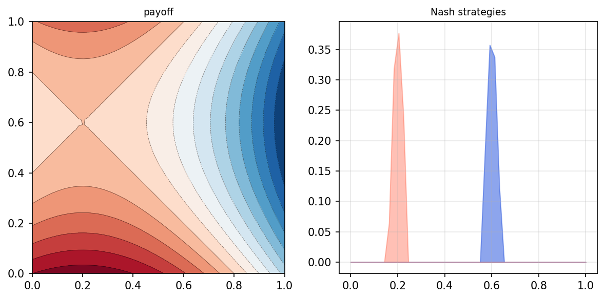](python/game-theory/game-theory.ipynb) | [](https://colab.research.google.com/github/gpeyre/mathematical-nexus/blob/main/python/game-theory/game-theory.ipynb) |
| **Gauss–Lucas Theorem**<br>Illustrates that each derivative shrinks the convex hull of polynomial roots until convergence to a single point. | [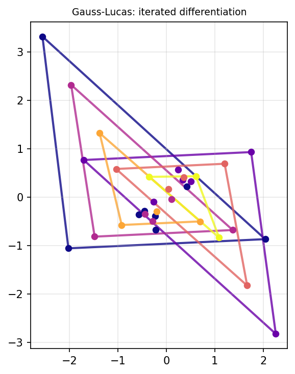](python/gauss-luca/gauss-luca.ipynb) | [](https://colab.research.google.com/github/gpeyre/mathematical-nexus/blob/main/python/gauss-luca/gauss-luca.ipynb) |
| **Gaussian Divergences**<br>Plots closed-form level sets of KL, Hellinger, Wasserstein-2, and Fisher–Rao divergences on the Gaussian manifold. | [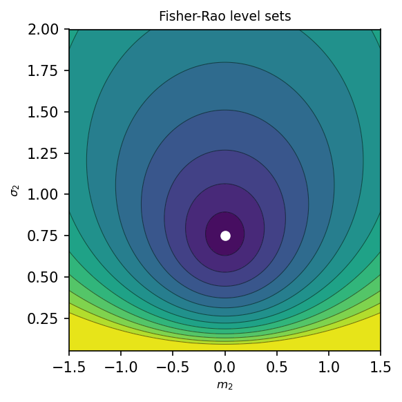](python/gaussian-fisher/gaussian-fisher.ipynb) | [](https://colab.research.google.com/github/gpeyre/mathematical-nexus/blob/main/python/gaussian-fisher/gaussian-fisher.ipynb) |
| **Gaussian Product & Convolution**<br>Visualizes how product (precision sum) and convolution (covariance sum) reshape Gaussian confidence ellipses. | [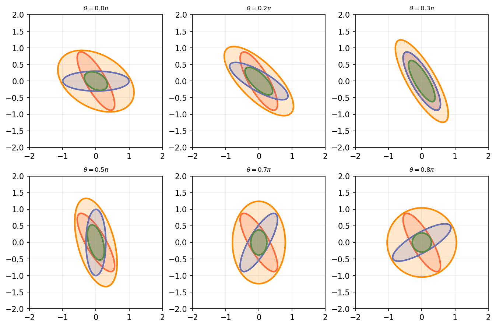](python/gaussian-prod-convol/gaussian-prod-convol.ipynb) | [](https://colab.research.google.com/github/gpeyre/mathematical-nexus/blob/main/python/gaussian-prod-convol/gaussian-prod-convol.ipynb) |
| **Non-Circular Gears**<br>Designs conjugate non-circular gear pairs via the rolling constraint and a bisection center-distance solver. | [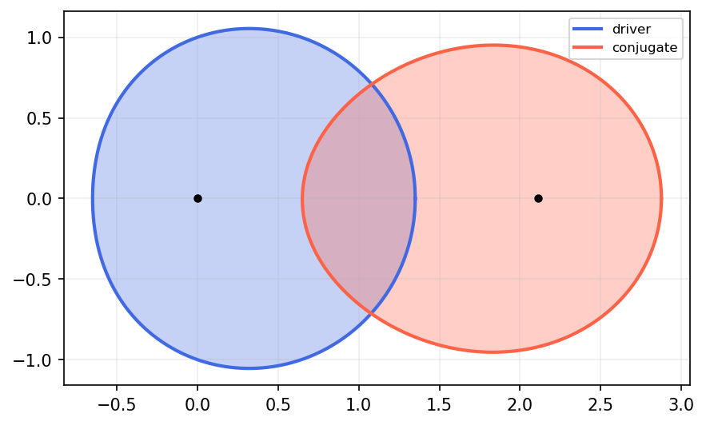](python/gears-non-circ/gears-non-circ.ipynb) | [](https://colab.research.google.com/github/gpeyre/mathematical-nexus/blob/main/python/gears-non-circ/gears-non-circ.ipynb) |
| **Geodesic Heat**<br>Computes weighted geodesic distances via the Cole–Hopf transformation, handling obstacles and smooth terrain. | [](python/geodesic-heat/geodesic-heat.ipynb) | [](https://colab.research.google.com/github/gpeyre/mathematical-nexus/blob/main/python/geodesic-heat/geodesic-heat.ipynb) |
| **Gershgorin Circles**<br>Localizes matrix eigenvalues inside Gershgorin disks and illustrates tightness under diagonal dominance. | [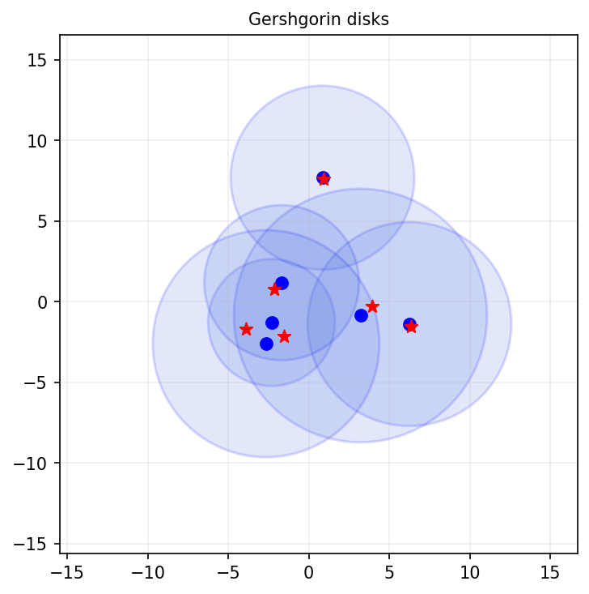](python/gershgorin/gershgorin.ipynb) | [](https://colab.research.google.com/github/gpeyre/mathematical-nexus/blob/main/python/gershgorin/gershgorin.ipynb) |
| **Gibbs Phenomenon**<br>Shows the persistent ~9% overshoot of Fourier partial sums at jump discontinuities and compares Fejér and Lanczos remedies. | [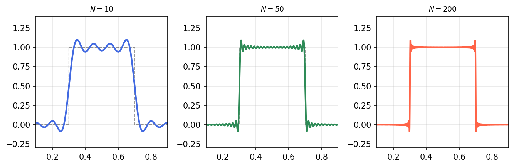](python/gibbs-oscillations/gibbs-oscillations.ipynb) | [](https://colab.research.google.com/github/gpeyre/mathematical-nexus/blob/main/python/gibbs-oscillations/gibbs-oscillations.ipynb) |
| **Gibbs Sampling & Metropolis–Hastings**<br>MCMC on a multiwell 2D energy: explores the effect of temperature ε on chain mixing, acceptance rate, and autocorrelation. | [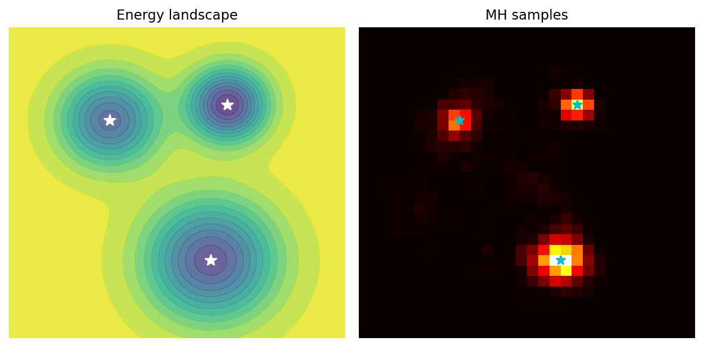](python/gibbs-sampling/gibbs-sampling.ipynb) | [](https://colab.research.google.com/github/gpeyre/mathematical-nexus/blob/main/python/gibbs-sampling/gibbs-sampling.ipynb) |
| **Gradient Descent on Rosenbrock**<br>Visualises gradient descent trajectories on the banana function for multiple step sizes and starting points, with interactive step-size control. | [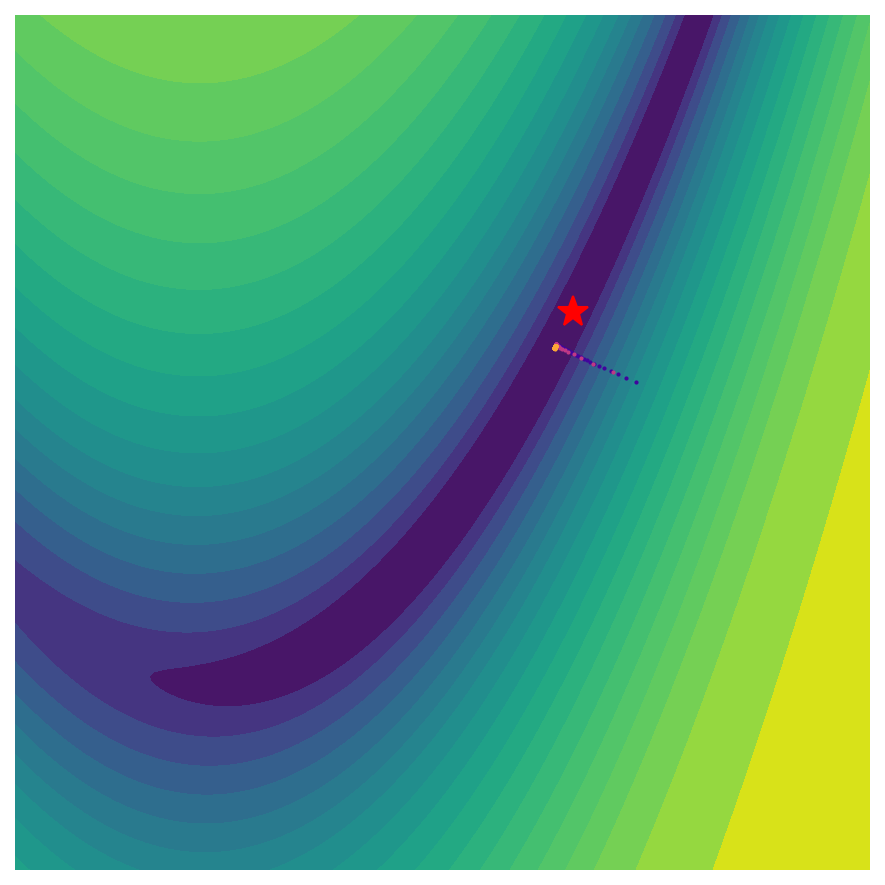](python/grad-desc/grad-desc.ipynb) | [](https://colab.research.google.com/github/gpeyre/mathematical-nexus/blob/main/python/grad-desc/grad-desc.ipynb) |
| **Mirror Descent & Bregman Divergences**<br>Compares Euclidean, KL, sqrt and log-barrier mirror maps on constrained optimisation over the probability simplex. | [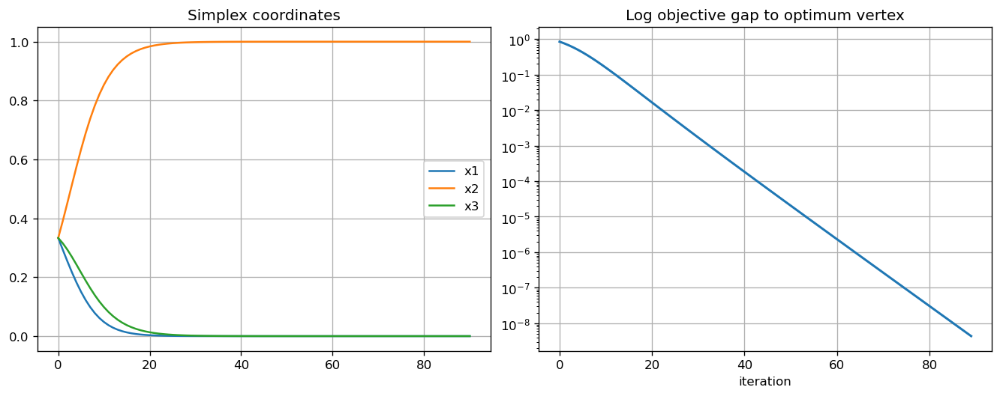](python/grad-desc-mirror/grad-desc-mirror.ipynb) | [](https://colab.research.google.com/github/gpeyre/mathematical-nexus/blob/main/python/grad-desc-mirror/grad-desc-mirror.ipynb) |
| **Momentum Methods: Heavy-Ball & Nesterov**<br>Demonstrates accelerated convergence on anisotropic quadratics comparing GD, heavy-ball, and Nesterov for varying condition numbers. | [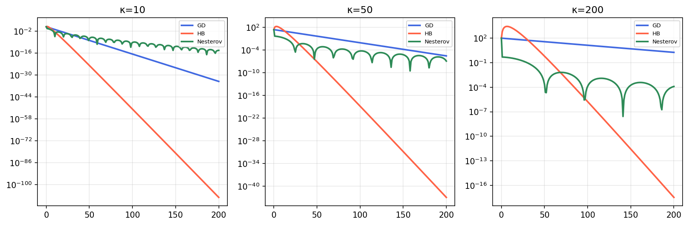](python/grad-desc-momentum/grad-desc-momentum.ipynb) | [](https://colab.research.google.com/github/gpeyre/mathematical-nexus/blob/main/python/grad-desc-momentum/grad-desc-momentum.ipynb) |
| **Gradient Flow as ODE**<br>Studies gradient descent as a continuous ODE, compares first-order gradient flow with heavy-ball and Nesterov ODEs via scipy solve_ivp. | [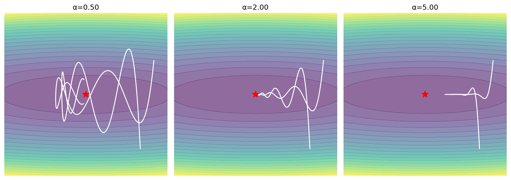](python/grad-desc-ode/grad-desc-ode.ipynb) | [](https://colab.research.google.com/github/gpeyre/mathematical-nexus/blob/main/python/grad-desc-ode/grad-desc-ode.ipynb) |
| **Gradient Descent on Quadratics**<br>Exact convergence analysis of GD on anisotropic quadratics: condition number effect, zig-zag trajectories, optimal fixed step vs. exact line search. | [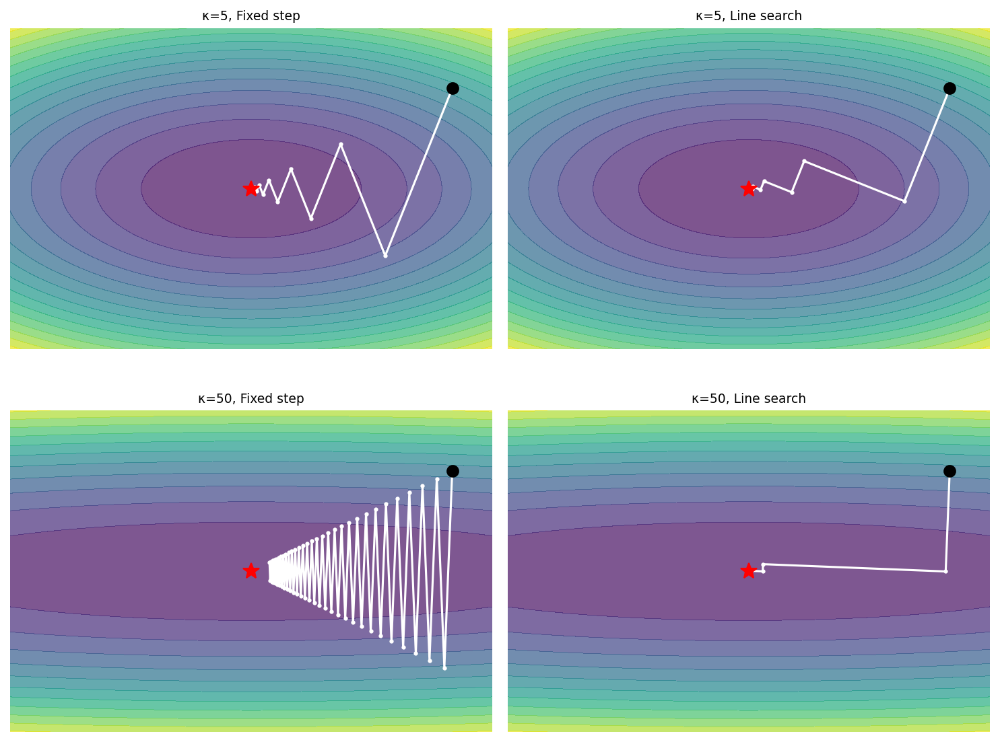](python/grad-desc-quad/grad-desc-quad.ipynb) | [](https://colab.research.google.com/github/gpeyre/mathematical-nexus/blob/main/python/grad-desc-quad/grad-desc-quad.ipynb) |
| **Gradient Flows in Lp Metrics**<br>Compares p-proximal gradient flows (p=1,1.5,2,4) showing how the metric shapes the trajectory and applies Lp regularisation to signal denoising. | [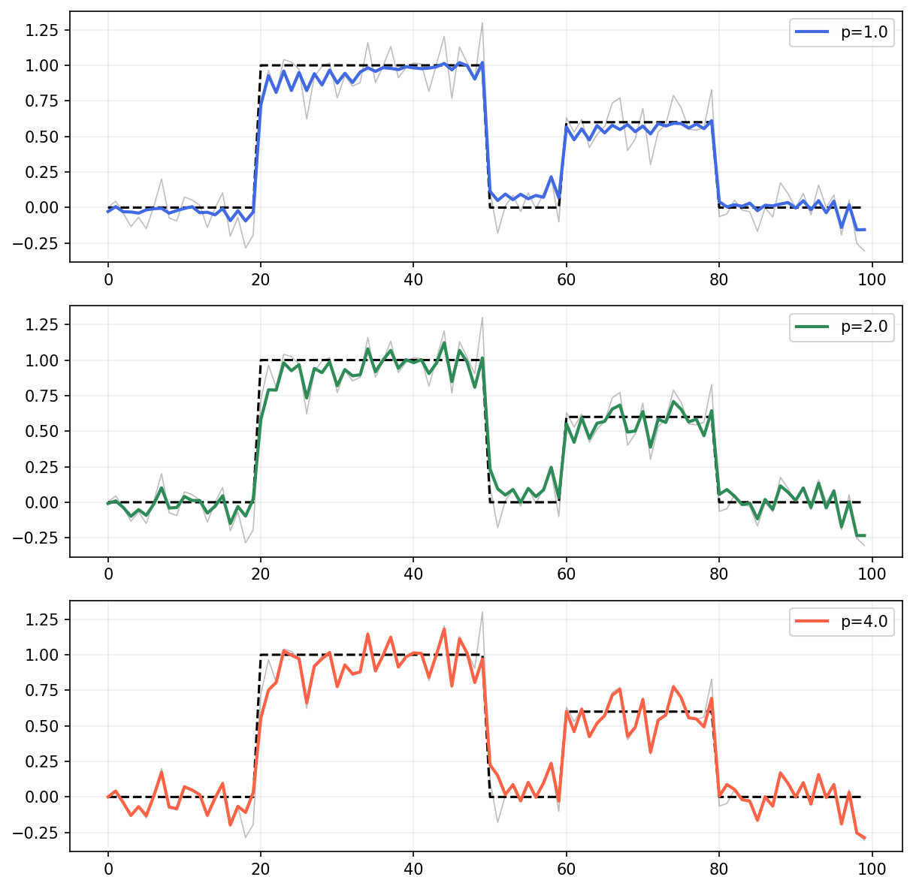](python/gradflow-metric/gradflow-metric.ipynb) | [](https://colab.research.google.com/github/gpeyre/mathematical-nexus/blob/main/python/gradflow-metric/gradflow-metric.ipynb) |
| **Graph Coloring & Chromatic Number**<br>Implements greedy and DSatur graph coloring on Delaunay triangulations and finds greedy cliques as chromatic lower bounds. | [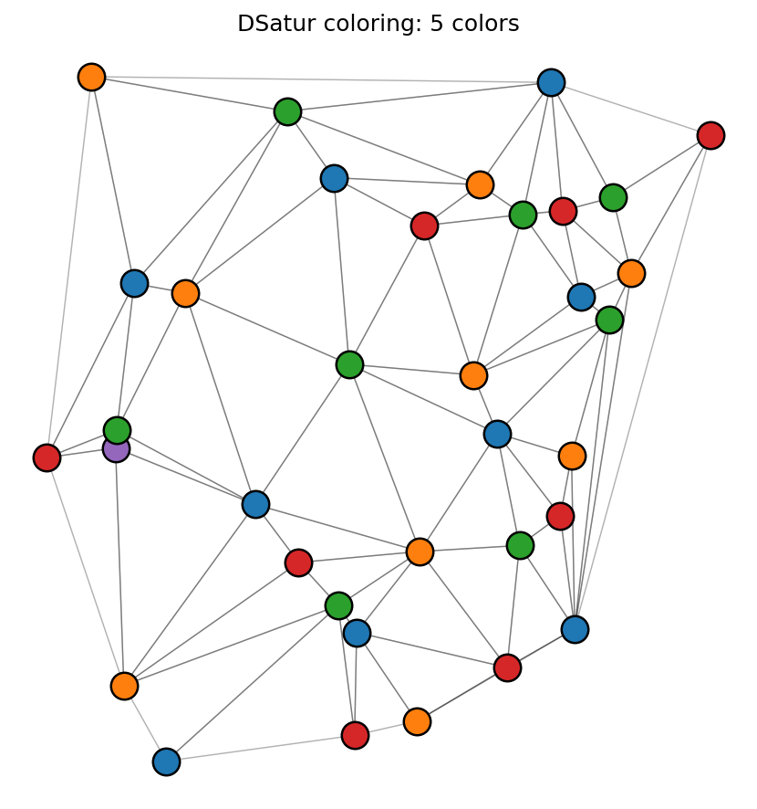](python/graph-coloring/graph-coloring.ipynb) | [](https://colab.research.google.com/github/gpeyre/mathematical-nexus/blob/main/python/graph-coloring/graph-coloring.ipynb) |
| **Graph Laplacian & Spectral Clustering**<br>Builds k-NN graph Laplacians, visualises the Fiedler vector for spectral bisection, and uses spectral embeddings for k-means clustering. | [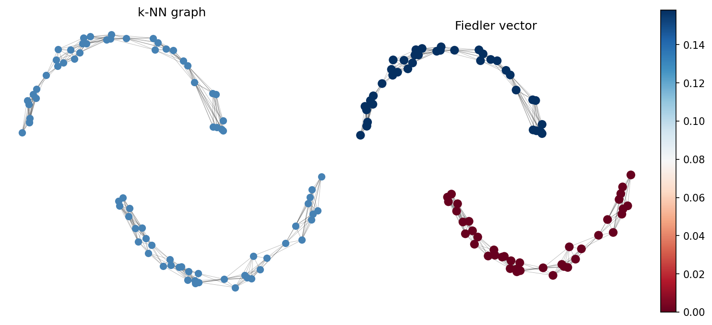](python/graph-laplacian/graph-laplacian.ipynb) | [](https://colab.research.google.com/github/gpeyre/mathematical-nexus/blob/main/python/graph-laplacian/graph-laplacian.ipynb) |
| **Graphical LASSO**<br>Estimates sparse precision matrices via ℓ1-penalised log-likelihood, traces the regularisation path, and recovers Gaussian graphical model structure. | [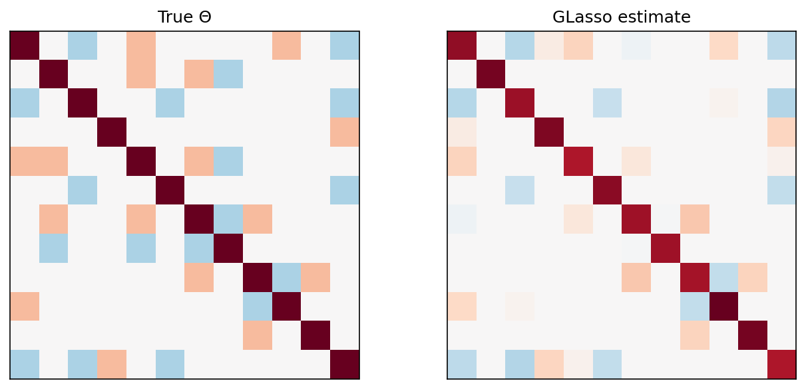](python/graphical-lasso/graphical-lasso.ipynb) | [](https://colab.research.google.com/github/gpeyre/mathematical-nexus/blob/main/python/graphical-lasso/graphical-lasso.ipynb) |
| **N-Body Gravitation**<br>Simulates gravitational N-body dynamics with Störmer–Verlet integrator, power-law forces and softening; includes the figure-8 three-body choreography. | [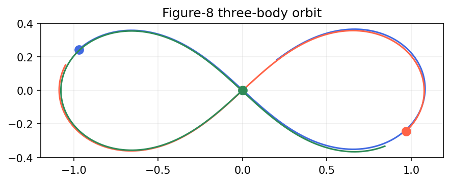](python/gravitation/gravitation.ipynb) | [](https://colab.research.google.com/github/gpeyre/mathematical-nexus/blob/main/python/gravitation/gravitation.ipynb) |
| **Gromov–Wasserstein Distance**<br>Compares metric measure spaces (circle vs. ellipse, rotated squares) via Sinkhorn-GW alternating optimisation; demonstrates rotation invariance. | [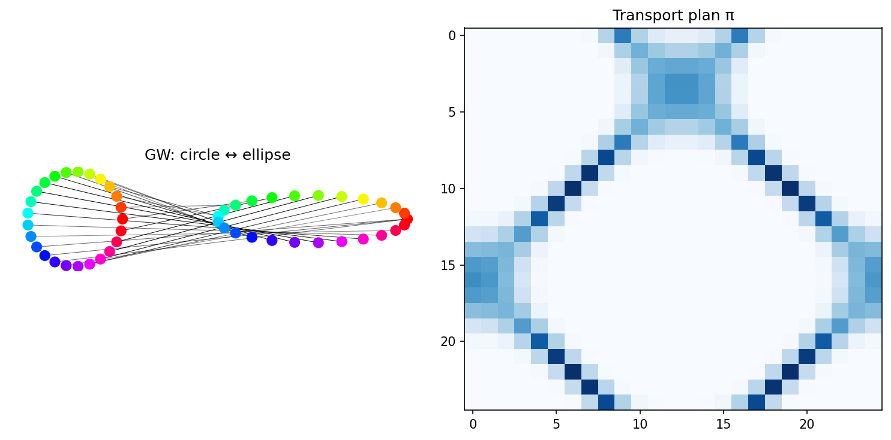](python/gromov-wasserstein/gromov-wasserstein.ipynb) | [](https://colab.research.google.com/github/gpeyre/mathematical-nexus/blob/main/python/gromov-wasserstein/gromov-wasserstein.ipynb) |
| **Haar & Walsh Transforms**<br>Implements fast Haar transform and Hadamard–Walsh transform; visualises multiresolution decomposition and hard-thresholding denoising. | [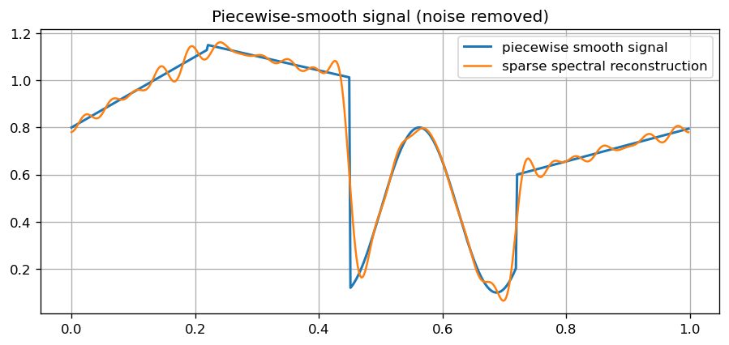](python/haar-walsh/haar-walsh.ipynb) | [](https://colab.research.google.com/github/gpeyre/mathematical-nexus/blob/main/python/haar-walsh/haar-walsh.ipynb) |
| **Harmonic Functions**<br>Solves the 2D Laplace equation with various Dirichlet boundary conditions and illustrates the orthogonal families of harmonic conjugate level sets. | [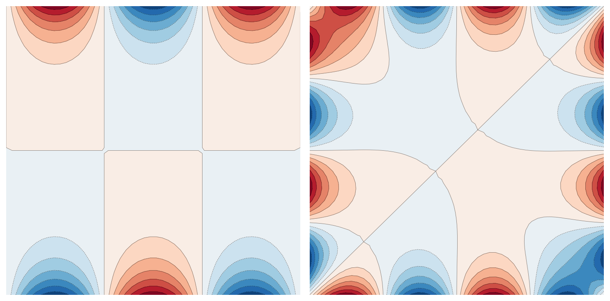](python/harmonic/harmonic.ipynb) | [](https://colab.research.google.com/github/gpeyre/mathematical-nexus/blob/main/python/harmonic/harmonic.ipynb) |
| **Harmonic Coordinates & Mesh Parameterisation**<br>Maps a square mesh to circle and square domains via harmonic (Dirichlet energy) parameterisation; transfers texture via the resulting coordinates. | [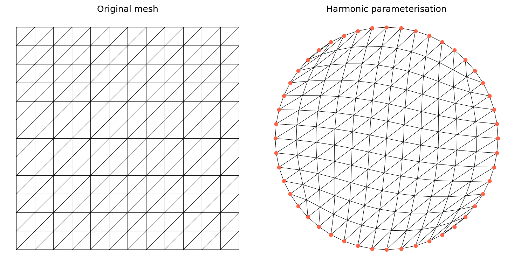](python/harmonic-coords/harmonic-coords.ipynb) | [](https://colab.research.google.com/github/gpeyre/mathematical-nexus/blob/main/python/harmonic-coords/harmonic-coords.ipynb) |
| **1D Heat Equation & Scale-Space**<br>Solves the heat equation via FFT-based Gaussian convolution, displays the scale-space stack, verifies the semigroup property, and shows Fourier decay. | [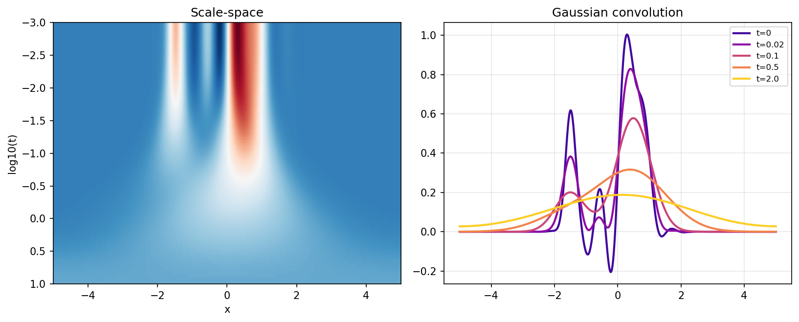](python/heat-1d/heat-1d.ipynb) | [](https://colab.research.google.com/github/gpeyre/mathematical-nexus/blob/main/python/heat-1d/heat-1d.ipynb) |
| **Heat Equation on Polynomials**<br>Tracks how heat flow evolves polynomial coefficients and roots; reveals root repulsion dynamics and their connection to Dyson Brownian motion. | [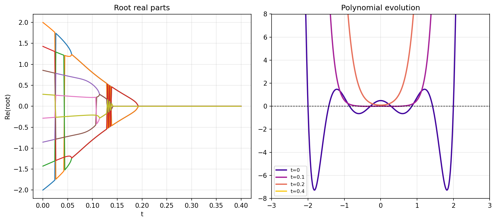](python/heat-polynomials/heat-polynomials.ipynb) | [](https://colab.research.google.com/github/gpeyre/mathematical-nexus/blob/main/python/heat-polynomials/heat-polynomials.ipynb) |
| **Heat Flow vs Total Variation Flow**<br>Side-by-side comparison of linear Gaussian smoothing and nonlinear TV flow on 1D signals and 2D images; highlights edge-preserving vs. edge-blurring behaviour. | [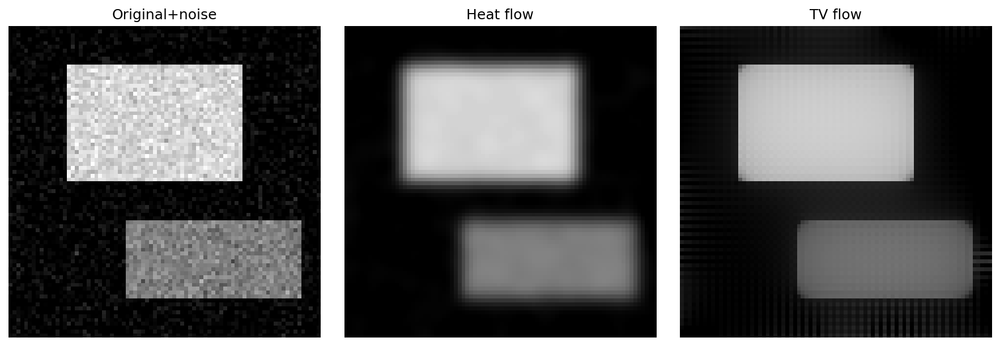](python/heat-vs-tv/heat-vs-tv.ipynb) | [](https://colab.research.google.com/github/gpeyre/mathematical-nexus/blob/main/python/heat-vs-tv/heat-vs-tv.ipynb) |
| **Heavy-Ball Method**<br>Analyses Polyak momentum via spectral radius maps, demonstrates the optimal (τ,β) for quadratics, and shows the trade-off between speed and stability on Rosenbrock. | [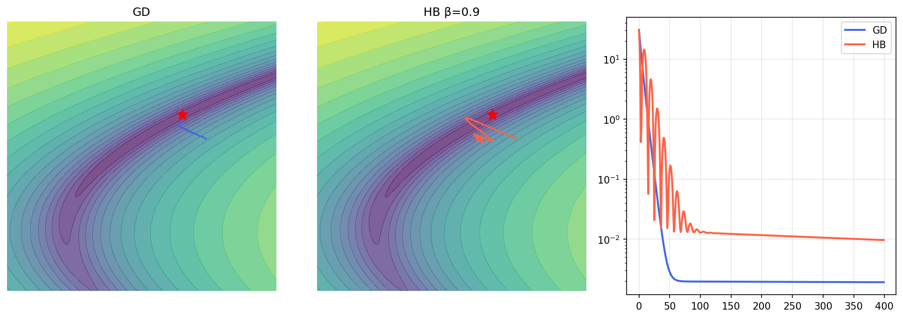](python/heavy-ball/heavy-ball.ipynb) | [](https://colab.research.google.com/github/gpeyre/mathematical-nexus/blob/main/python/heavy-ball/heavy-ball.ipynb) |
| **Hermite Functions & Quantum Oscillator**<br>Computes Gauss–Hermite functions as Fourier eigenfunctions and energy eigenstates of the harmonic oscillator; displays Wigner phase-space distributions. | [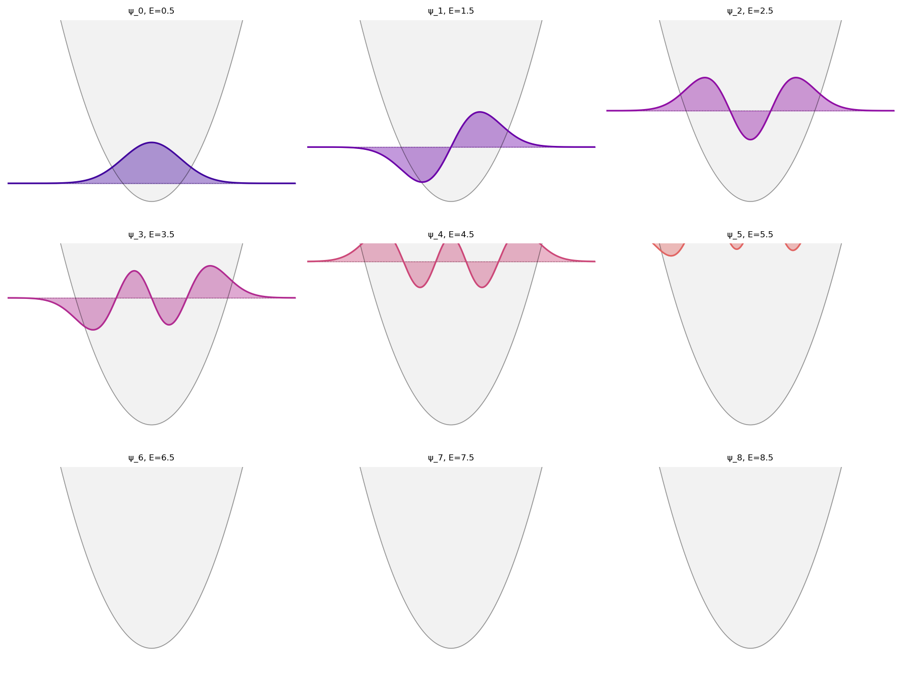](python/hermite-function/hermite-function.ipynb) | [](https://colab.research.google.com/github/gpeyre/mathematical-nexus/blob/main/python/hermite-function/hermite-function.ipynb) |
| **Hilbert Curve**<br>Constructs space-filling Hilbert curves of arbitrary order via recursive quadrant rotation and visualizes locality-preserving index maps. | [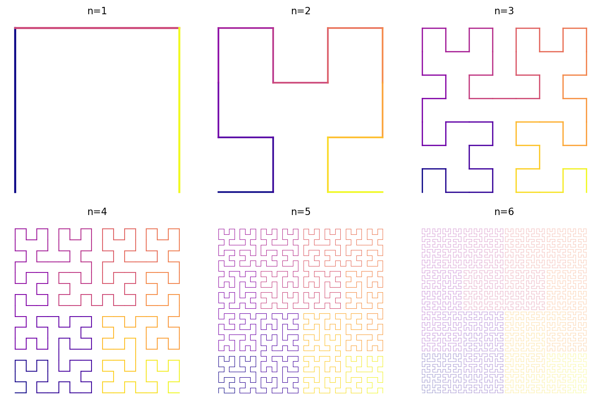](python/hilbert-curve/hilbert-curve.ipynb) | [](https://colab.research.google.com/github/gpeyre/mathematical-nexus/blob/main/python/hilbert-curve/hilbert-curve.ipynb) |
| **Histogram Equalization & Matching**<br>Equalizes image histograms via the empirical CDF rank transform and performs histogram matching as 1D optimal transport. | [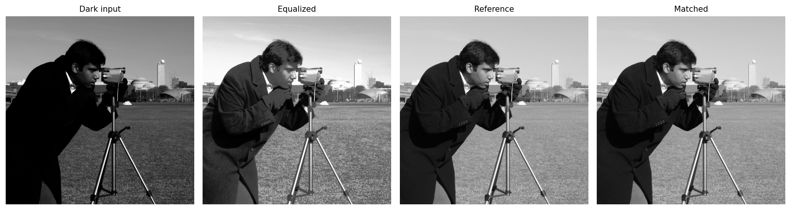](python/hist-eq/hist-eq.ipynb) | [](https://colab.research.google.com/github/gpeyre/mathematical-nexus/blob/main/python/hist-eq/hist-eq.ipynb) |
| **Hölder Inequality**<br>Visualizes the Hölder defect on 2D grids and plots conjugate Lp/Lq unit balls as polar dual convex bodies. | [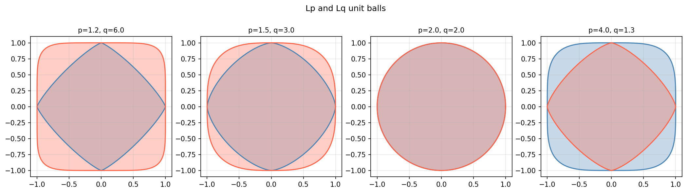](python/holder-inequality/holder-inequality.ipynb) | [](https://colab.research.google.com/github/gpeyre/mathematical-nexus/blob/main/python/holder-inequality/holder-inequality.ipynb) |
| **Hopfield Network**<br>Implements Hebbian associative memory as an Ising-like spin system; demonstrates energy-descent convergence and pattern retrieval capacity. | [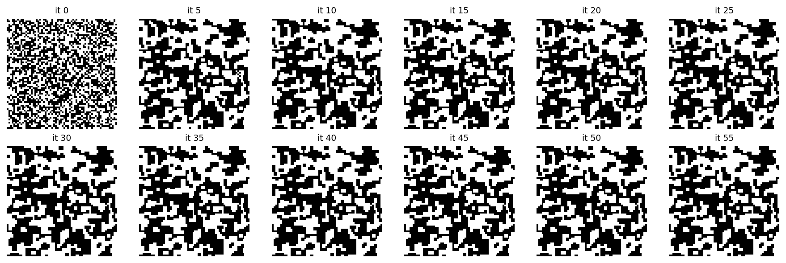](python/hopfield-network/hopfield-network.ipynb) | [](https://colab.research.google.com/github/gpeyre/mathematical-nexus/blob/main/python/hopfield-network/hopfield-network.ipynb) |
| **Gaussian Bump Algebra**<br>Explores the algebraic structure of Gaussian bump sums: products reveal midpoint geometry and alternating sign patterns on circle configurations. | [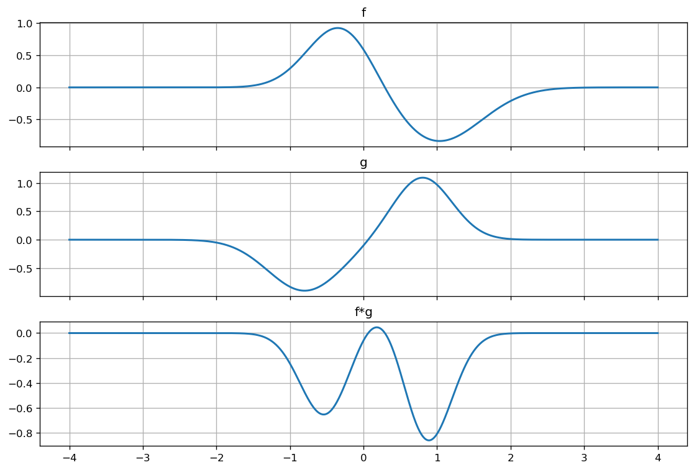](python/hump-algebra/hump-algebra.ipynb) | [](https://colab.research.google.com/github/gpeyre/mathematical-nexus/blob/main/python/hump-algebra/hump-algebra.ipynb) |
| **Independent Component Analysis**<br>Separates mixed non-Gaussian sources via FastICA with tanh contrast; demonstrates whitening, deflation, and the effect of source non-Gaussianity. | [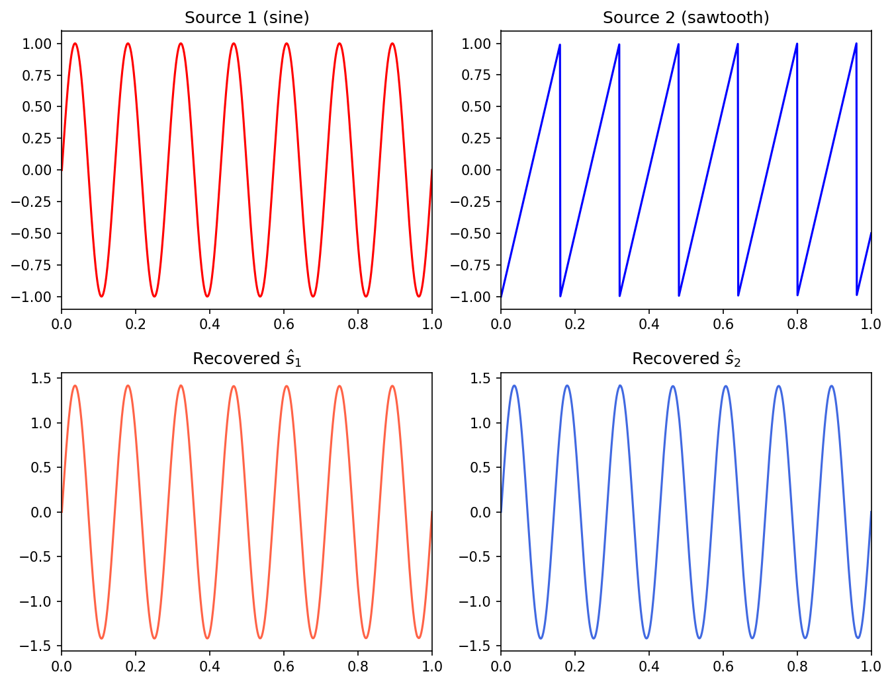](python/ica/ica.ipynb) | [](https://colab.research.google.com/github/gpeyre/mathematical-nexus/blob/main/python/ica/ica.ipynb) |
| **Iterative Closest Point**<br>Registers point clouds via SVD-based Procrustes alignment with KD-tree nearest-neighbor matching; visualizes convergence from different initializations. | [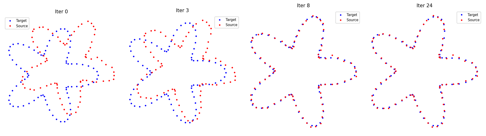](python/icp/icp.ipynb) | [](https://colab.research.google.com/github/gpeyre/mathematical-nexus/blob/main/python/icp/icp.ipynb) |
| **Integral Lines & LIC**<br>Integrates streamlines of random smooth vector fields and visualizes texture via Line Integral Convolution (LIC). | [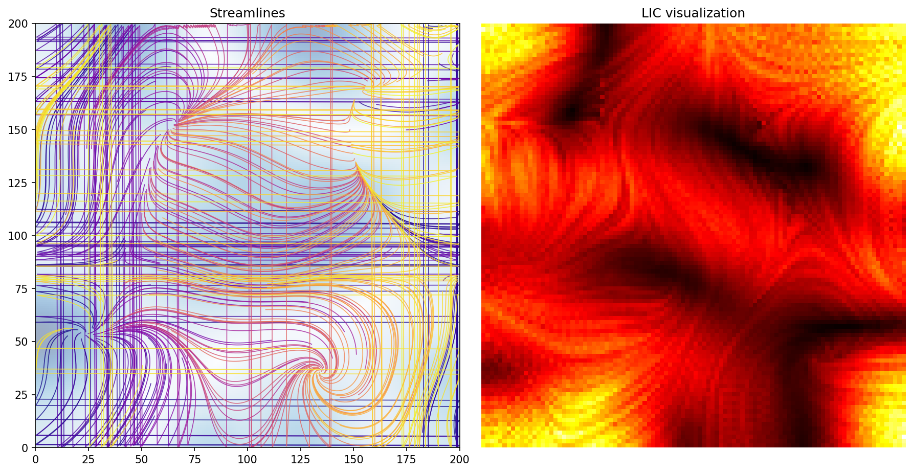](python/integral-lines/integral-lines.ipynb) | [](https://colab.research.google.com/github/gpeyre/mathematical-nexus/blob/main/python/integral-lines/integral-lines.ipynb) |
| **Interior Point Method**<br>Solves linear programs via the log-barrier method; traces the central path as the barrier parameter decreases to zero on a random convex polytope. | [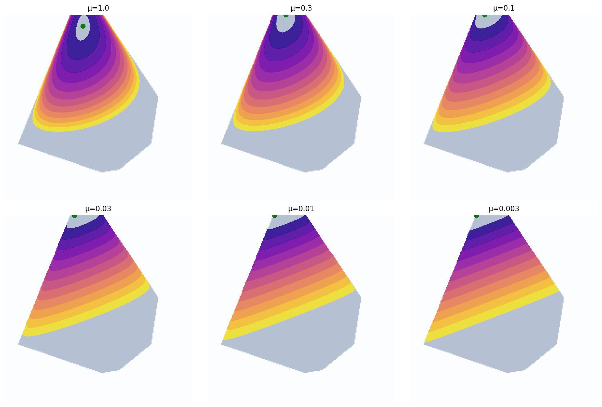](python/interior-points/interior-points.ipynb) | [](https://colab.research.google.com/github/gpeyre/mathematical-nexus/blob/main/python/interior-points/interior-points.ipynb) |
| **Interpolation Visualization**<br>Compares nearest, bilinear, bicubic, and spline interpolation on coarse 2D grids; renders 3D surfaces and morphs between two functions. | [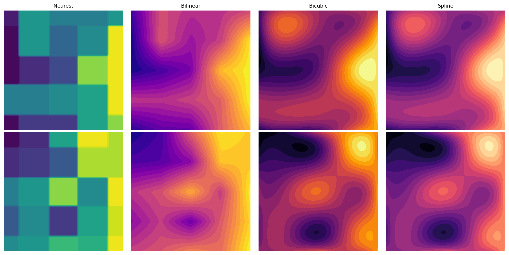](python/interpol-vizu/interpol-vizu.ipynb) | [](https://colab.research.google.com/github/gpeyre/mathematical-nexus/blob/main/python/interpol-vizu/interpol-vizu.ipynb) |
| **Natural Neighbor Interpolation**<br>Implements Sibson's Voronoi-area interpolation; compares nearest-neighbor vs. natural-neighbor weights on scattered data. | [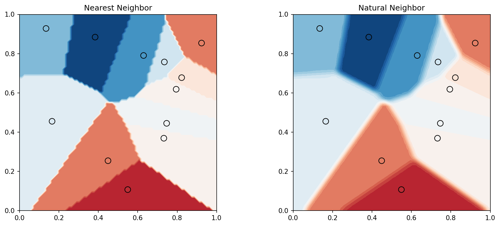](python/interpolation-natural/interpolation-natural.ipynb) | [](https://colab.research.google.com/github/gpeyre/mathematical-nexus/blob/main/python/interpolation-natural/interpolation-natural.ipynb) |
| **RKHS Interpolation**<br>Interpolates scattered data via the representer theorem with five kernels (Gaussian, Laplacian, Matérn, Multiquadric, Inverse-quadratic); sweeps bandwidth. | [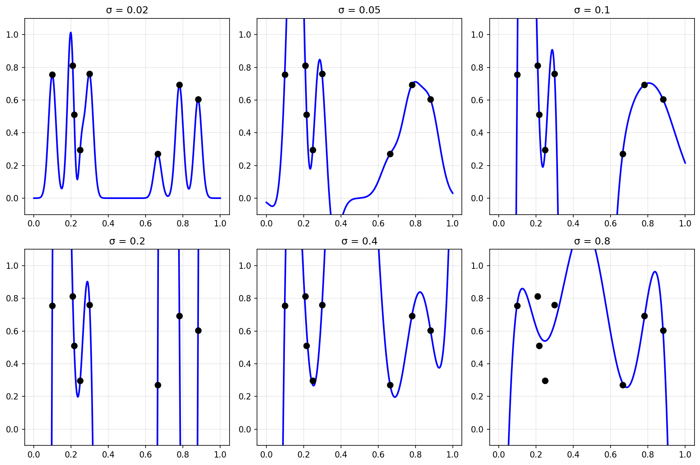](python/interpolation-rkhs/interpolation-rkhs.ipynb) | [](https://colab.research.google.com/github/gpeyre/mathematical-nexus/blob/main/python/interpolation-rkhs/interpolation-rkhs.ipynb) |
| **Shepard's Interpolation**<br>Applies inverse-distance weighting in 1D and 2D; illustrates the flat-spot artifact and Voronoi limit as the power q→∞. | [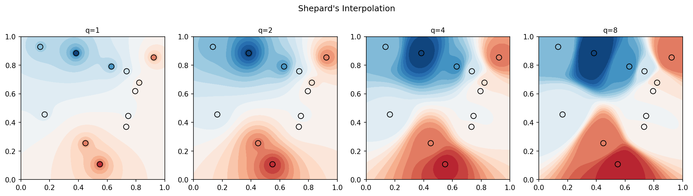](python/interpolation-shepard/interpolation-shepard.ipynb) | [](https://colab.research.google.com/github/gpeyre/mathematical-nexus/blob/main/python/interpolation-shepard/interpolation-shepard.ipynb) |
| **Inverse Kinematics**<br>Computes joint angles for a planar robot arm via Levenberg–Marquardt; shows the Jacobian geometry and the effect of damping on convergence. | [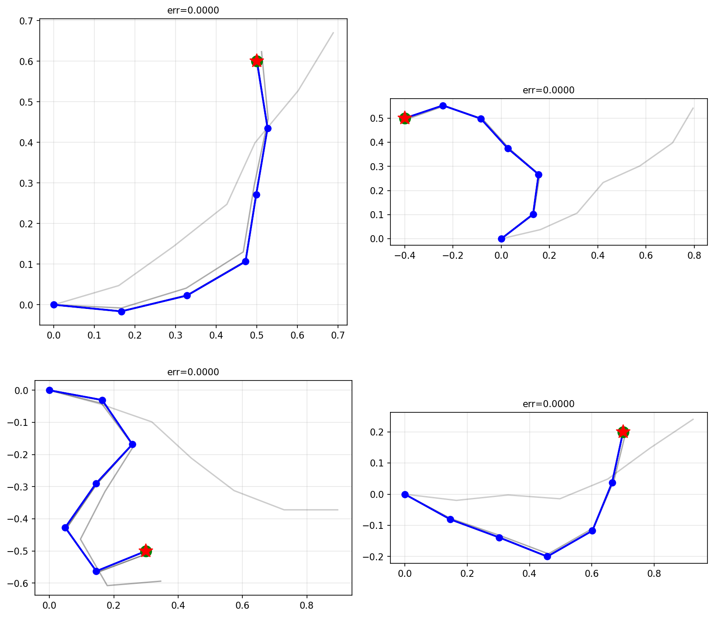](python/inverse-kinematics/inverse-kinematics.ipynb) | [](https://colab.research.google.com/github/gpeyre/mathematical-nexus/blob/main/python/inverse-kinematics/inverse-kinematics.ipynb) |
| **Ising Model & Phase Transition**<br>Simulates 2D Ising spin dynamics via checkerboard Metropolis; measures magnetization, susceptibility, and critical exponents near Onsager's Tc. | [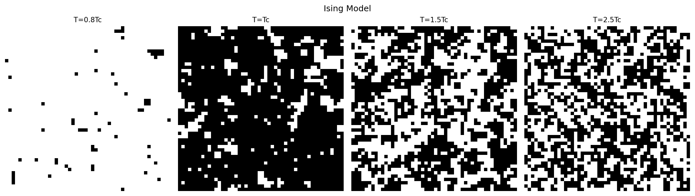](python/ising-model/ising-model.ipynb) | [](https://colab.research.google.com/github/gpeyre/mathematical-nexus/blob/main/python/ising-model/ising-model.ipynb) |
| **ISTA & FISTA**<br>Solves LASSO via soft-thresholding proximal iterations; proves O(1/k) vs O(1/k²) rates and visualizes the L1 ball geometry and regularization path. | [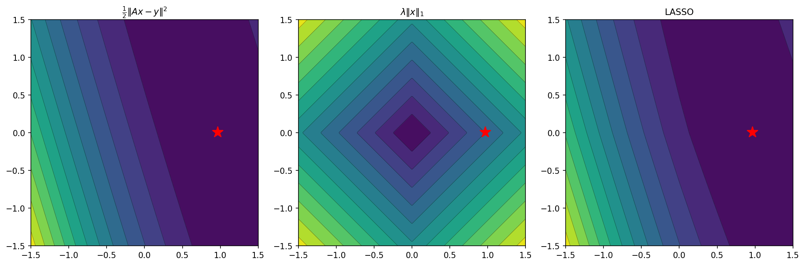](python/ista/ista.ipynb) | [](https://colab.research.google.com/github/gpeyre/mathematical-nexus/blob/main/python/ista/ista.ipynb) |
| **Iterated Polygons**<br>Applies the midpoint map to polygon vertices; analyzes convergence to an ellipse via DFT circulant eigenvalues and interactive step/shape controls. | [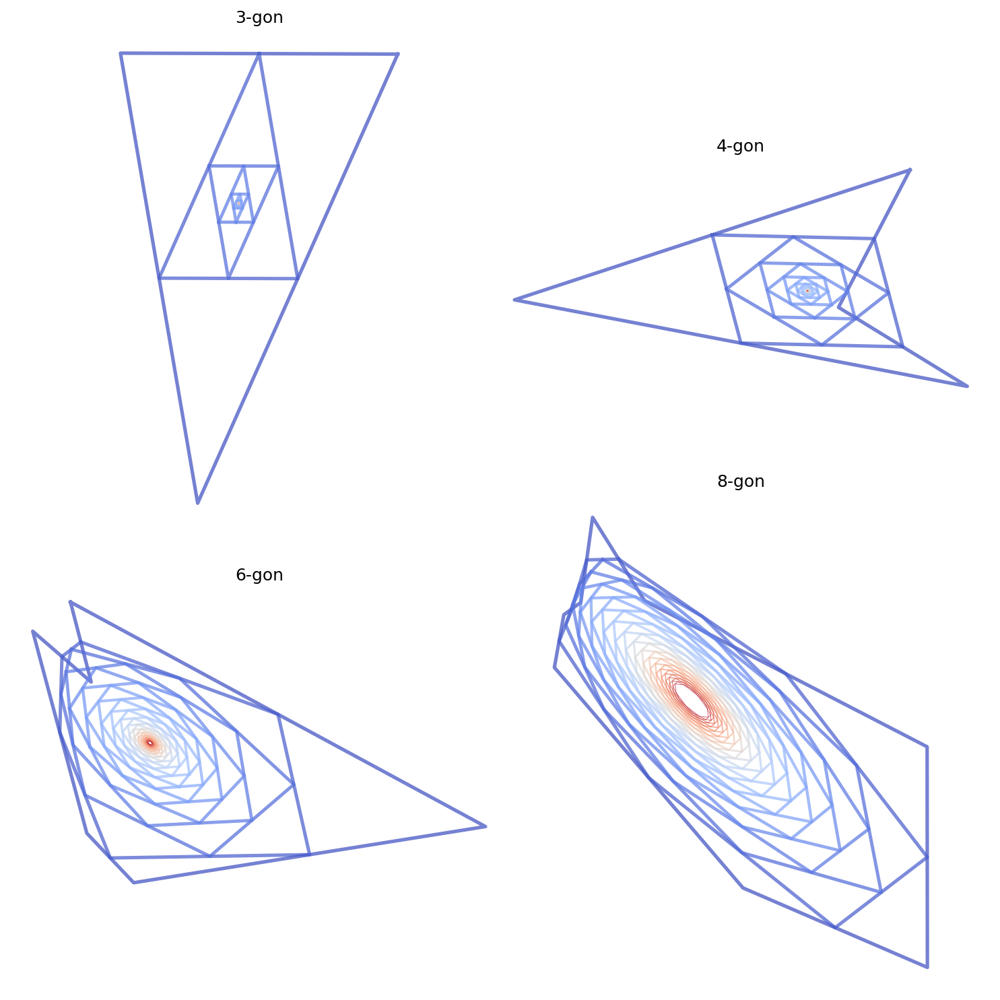](python/iterated-polygons/iterated-polygons.ipynb) | [](https://colab.research.google.com/github/gpeyre/mathematical-nexus/blob/main/python/iterated-polygons/iterated-polygons.ipynb) |
| **JKO Flow & Porous Medium Equation**<br>Simulates the porous medium equation as a Wasserstein gradient flow; tracks Barenblatt self-similar profiles and free-energy dissipation. | [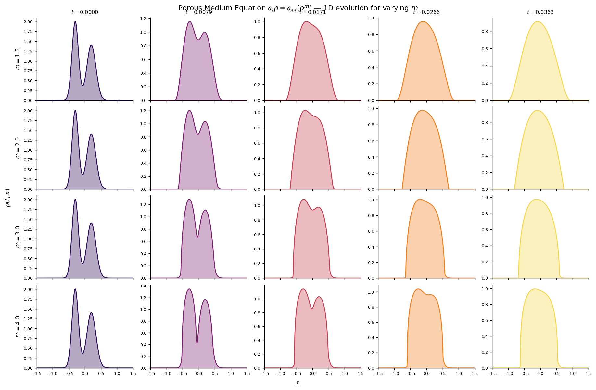](python/jko-flow/jko-flow.ipynb) | [](https://colab.research.google.com/github/gpeyre/mathematical-nexus/blob/main/python/jko-flow/jko-flow.ipynb) |
| **Joukowski Transform**<br>Maps circles to airfoils via the conformal map w=(z+1/z)/2; explores camber, thickness, and potential flow with the Kutta condition. | [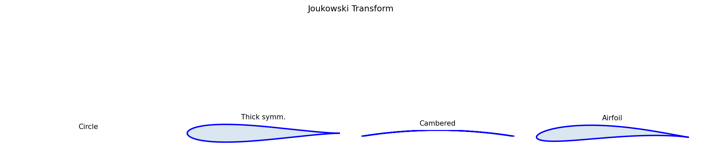](python/joukowski/joukowski.ipynb) | [](https://colab.research.google.com/github/gpeyre/mathematical-nexus/blob/main/python/joukowski/joukowski.ipynb) |
| **Julia Sets**<br>Renders Julia set escape-time fractals with smooth coloring; visualizes self-similar zooms and the Mandelbrot-set parameter map interactively. | [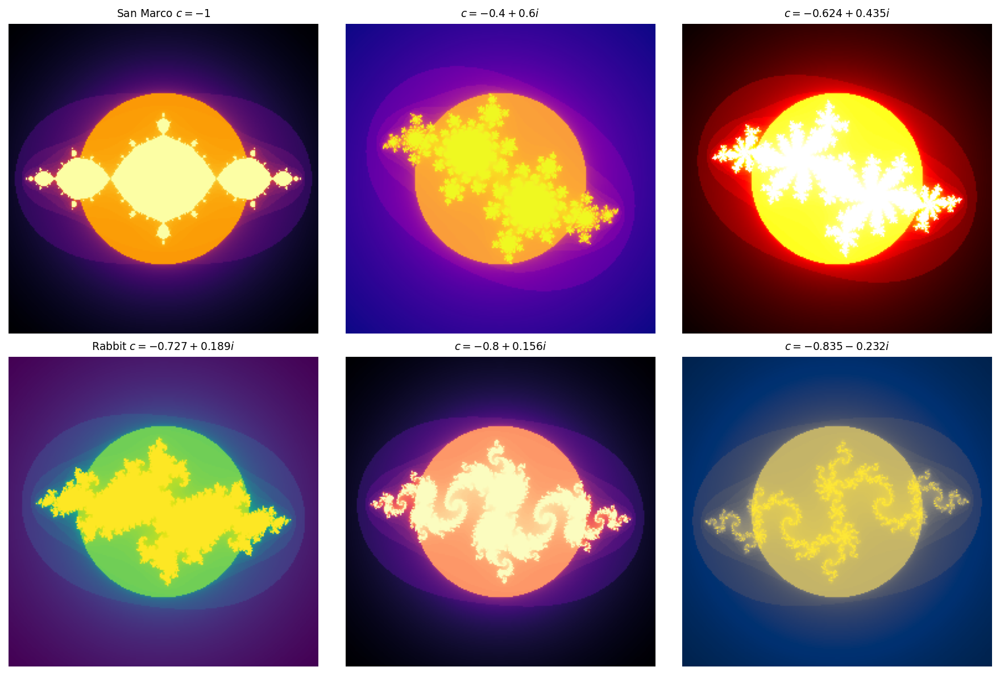](python/julia-sets/julia-sets.ipynb) | [](https://colab.research.google.com/github/gpeyre/mathematical-nexus/blob/main/python/julia-sets/julia-sets.ipynb) |
| **K-Nearest Neighbors**<br>Classifies points by majority vote among k nearest neighbors; visualizes Voronoi-like decision boundaries and the bias-variance tradeoff as k varies. | [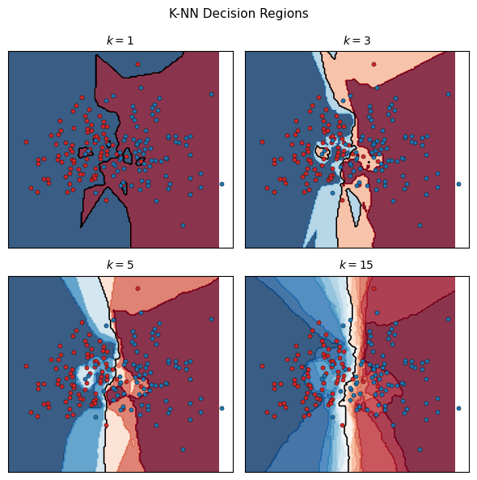](python/k-nn/k-nn.ipynb) | [](https://colab.research.google.com/github/gpeyre/mathematical-nexus/blob/main/python/k-nn/k-nn.ipynb) |
| **Kaczmarz Projections**<br>Solves linear systems via cyclic and randomized row projections; proves exponential convergence and compares deterministic vs. random sweep strategies. | [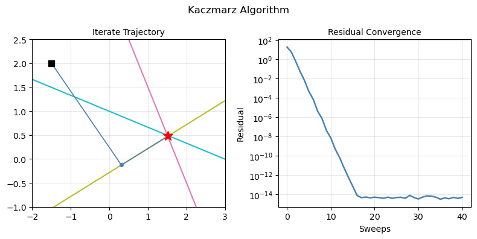](python/kaczmarz/kaczmarz.ipynb) | [](https://colab.research.google.com/github/gpeyre/mathematical-nexus/blob/main/python/kaczmarz/kaczmarz.ipynb) |
| **Kalman Filter**<br>Tracks noisy 2D trajectories via predict-update Gaussian belief propagation; shows confidence ellipses and the role of process and measurement noise covariances. | [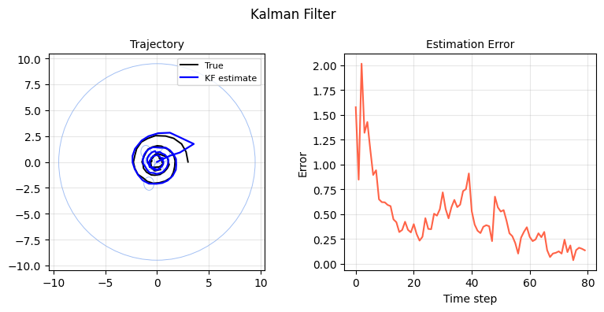](python/kalman/kalman.ipynb) | [](https://colab.research.google.com/github/gpeyre/mathematical-nexus/blob/main/python/kalman/kalman.ipynb) |
| **Kernel Approximation (1D)**<br>Approximates shift-invariant kernels via random Fourier features (Bochner's theorem); compares exact vs. approximate kernel matrices as the number of features grows. | [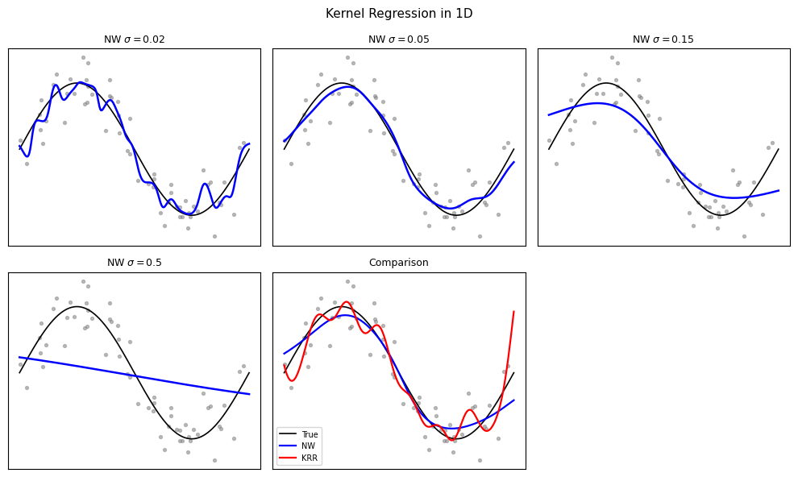](python/kernel-approx-1d/kernel-approx-1d.ipynb) | [](https://colab.research.google.com/github/gpeyre/mathematical-nexus/blob/main/python/kernel-approx-1d/kernel-approx-1d.ipynb) |
| **Kernel PCA**<br>Extracts nonlinear structure via spectral decomposition in feature space; unrolls Swiss rolls and separates clusters invisible to linear PCA. | [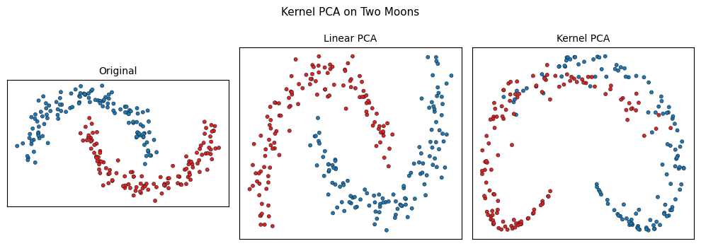](python/kernel-pca/kernel-pca.ipynb) | [](https://colab.research.google.com/github/gpeyre/mathematical-nexus/blob/main/python/kernel-pca/kernel-pca.ipynb) |
| **Kernel SVM**<br>Learns nonlinear boundaries via the kernel trick; visualizes support vectors, margins, and decision surfaces for RBF, polynomial, and linear kernels. | [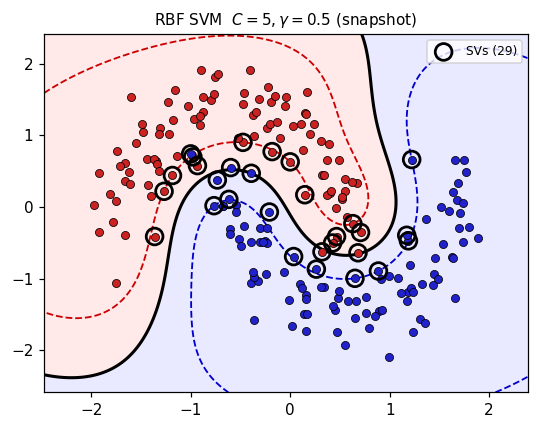](python/kernel-svm/kernel-svm.ipynb) | [](https://colab.research.google.com/github/gpeyre/mathematical-nexus/blob/main/python/kernel-svm/kernel-svm.ipynb) |
| **Kinetics & Phase Space**<br>Simulates chemical reaction kinetics and ODE phase-space dynamics; shows equilibria, limit cycles, and bifurcations in Lotka-Volterra and SIR models. | [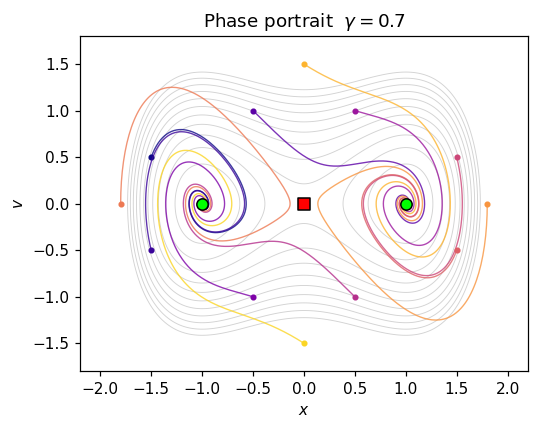](python/kinetics-evolution/kinetics-evolution.ipynb) | [](https://colab.research.google.com/github/gpeyre/mathematical-nexus/blob/main/python/kinetics-evolution/kinetics-evolution.ipynb) |
| **K-means++**<br>Improves K-means initialization via D²-weighted seeding; reduces variance in cluster quality and compares convergence against uniform random initialization. | [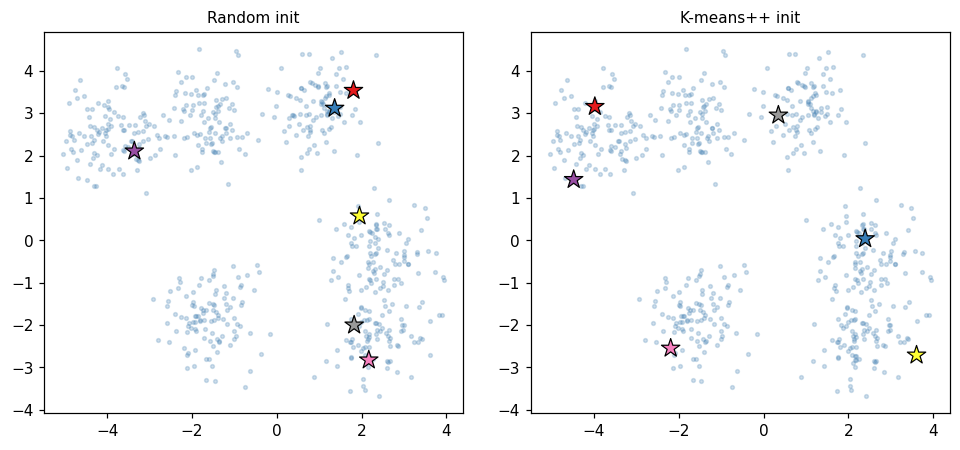](python/kmean++/kmeanpp.ipynb) | [](https://colab.research.google.com/github/gpeyre/mathematical-nexus/blob/main/python/kmean%2B%2B/kmeanpp.ipynb) |
| **K-means / Lloyd**<br>Iterates Lloyd's algorithm for vector quantization; tracks energy decrease, Voronoi region evolution, and centroid motion to convergence. | [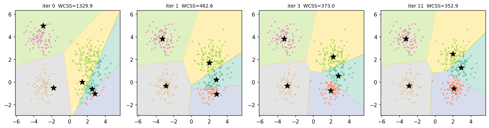](python/kmeans/kmeans.ipynb) | [](https://colab.research.google.com/github/gpeyre/mathematical-nexus/blob/main/python/kmeans/kmeans.ipynb) |
| **Kriging / GP Regression**<br>Fits a Gaussian process to scattered data with full predictive uncertainty; explores RBF, Matérn, and periodic covariance kernels and the effect of length scale. | [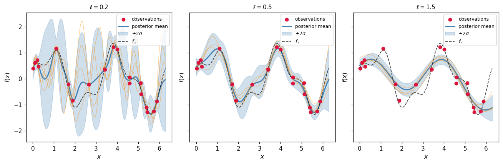](python/kriging/kriging.ipynb) | [](https://colab.research.google.com/github/gpeyre/mathematical-nexus/blob/main/python/kriging/kriging.ipynb) |
| **Kubo-Ando Matrix Mean**<br>Computes geodesic paths and Karcher means on the cone of symmetric positive-definite matrices; visualizes the geometry of SPD space via matrix operator means. | [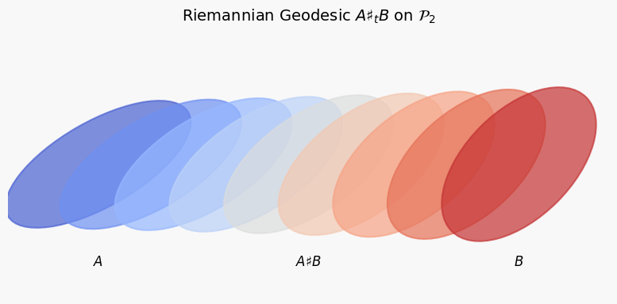](python/kubo-matrix-mean/kubo-matrix-mean.ipynb) | [](https://colab.research.google.com/github/gpeyre/mathematical-nexus/blob/main/python/kubo-matrix-mean/kubo-matrix-mean.ipynb) |
| **Lagrange & Hermite Interpolation**<br>Constructs polynomial interpolants via Lagrange and Hermite bases; demonstrates Runge's phenomenon, barycentric weights, and osculating conditions. | [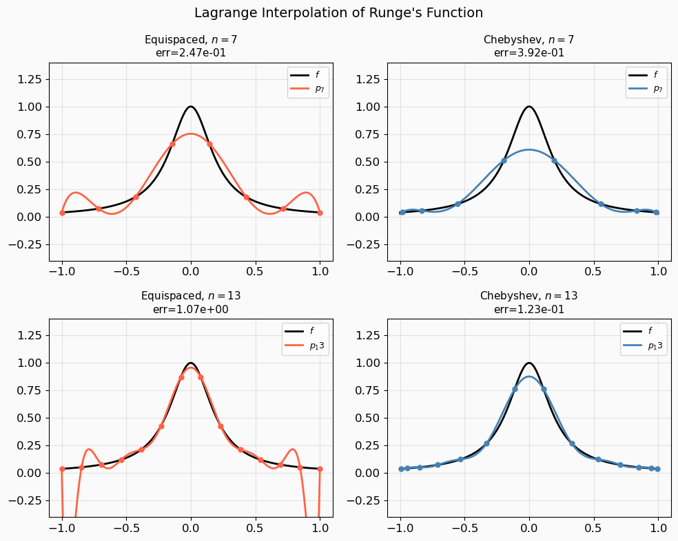](python/lagrange-hermite/lagrange-hermite.ipynb) | [](https://colab.research.google.com/github/gpeyre/mathematical-nexus/blob/main/python/lagrange-hermite/lagrange-hermite.ipynb) |
| **Lagrangian Particle Flows**<br>Tracks fluid particles along smooth velocity fields; illustrates deformation maps, flow maps, and the advection of density distributions. | [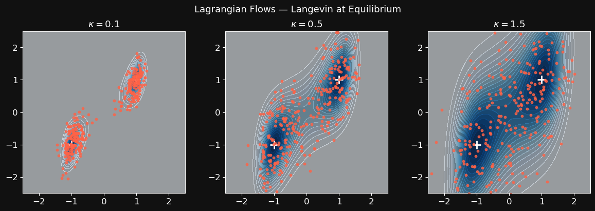](python/lagrangian-flows/lagrangian-flows.ipynb) | [](https://colab.research.google.com/github/gpeyre/mathematical-nexus/blob/main/python/lagrangian-flows/lagrangian-flows.ipynb) |
| **Lagrangian vs. Eulerian**<br>Contrasts particle-based and grid-based descriptions of the same fluid transport; shows how the two perspectives relate via the flow map and material derivative. | [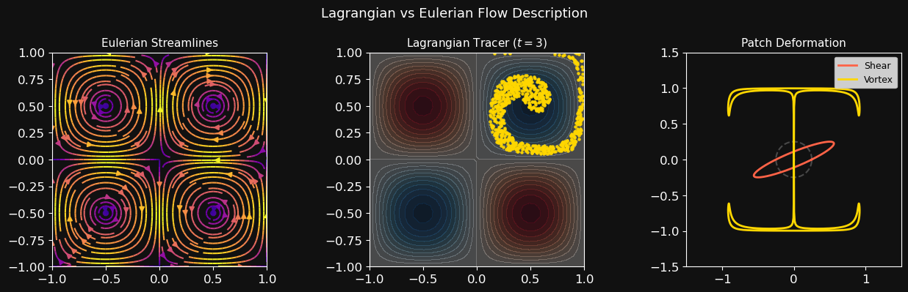](python/lagrangian-vs-eulerian/lagrangian-vs-eulerian.ipynb) | [](https://colab.research.google.com/github/gpeyre/mathematical-nexus/blob/main/python/lagrangian-vs-eulerian/lagrangian-vs-eulerian.ipynb) |
| **Laplacian Eigenmaps**<br>Embeds a data manifold via the low-frequency eigenvectors of the graph Laplacian; unrolls Swiss rolls and reveals nonlinear structure invisible to PCA. | [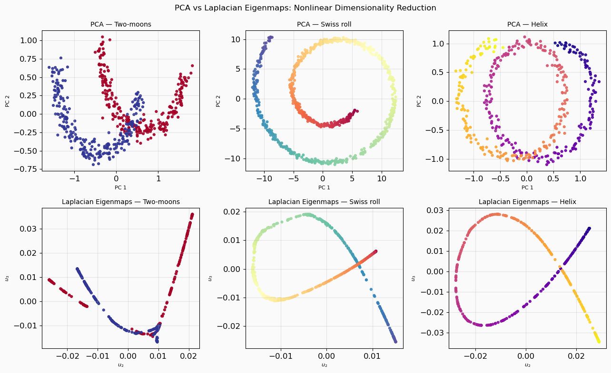](python/laplacian-eigenmaps/laplacian-eigenmaps.ipynb) | [](https://colab.research.google.com/github/gpeyre/mathematical-nexus/blob/main/python/laplacian-eigenmaps/laplacian-eigenmaps.ipynb) |
| **Laplacian Pyramid**<br>Decomposes images into Gaussian and Laplacian scale stacks; demonstrates perfect reconstruction and multi-scale seamless blending. | [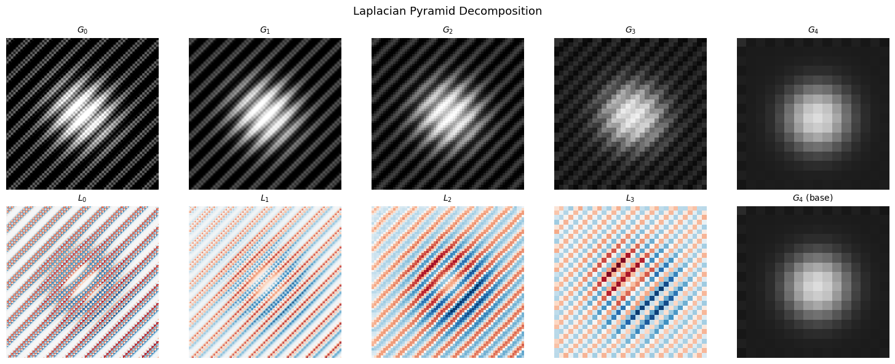](python/laplacian-pyramid/laplacian-pyramid.ipynb) | [](https://colab.research.google.com/github/gpeyre/mathematical-nexus/blob/main/python/laplacian-pyramid/laplacian-pyramid.ipynb) |
| **Laplacian Spectrum**<br>Analyzes eigenvalues and eigenvectors of path, cycle, and grid graph Laplacians; visualizes the Fiedler vector and spectral gap for graph connectivity. | [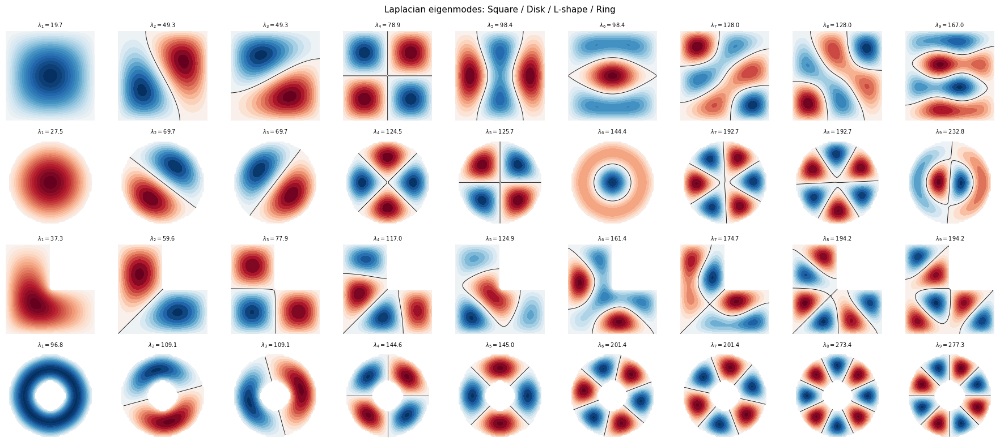](python/laplacian-spectrum/laplacian-spectrum.ipynb) | [](https://colab.research.google.com/github/gpeyre/mathematical-nexus/blob/main/python/laplacian-spectrum/laplacian-spectrum.ipynb) |
| **Weighted Graph Laplacian**<br>Studies how edge weights reshape the Laplacian spectrum and Fiedler vector; compares uniform, distance-based, and Gaussian weighting on random geometric graphs. | [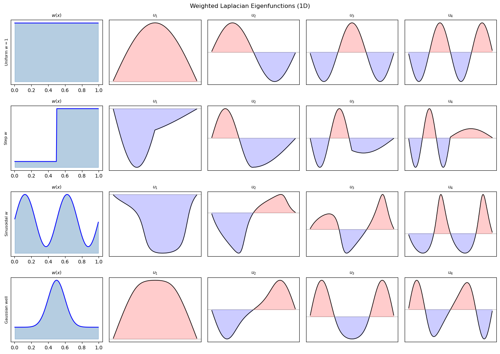](python/laplacian-weighted/laplacian-weighted.ipynb) | [](https://colab.research.google.com/github/gpeyre/mathematical-nexus/blob/main/python/laplacian-weighted/laplacian-weighted.ipynb) |
| **LDA & QDA**<br>Compares Linear and Quadratic Discriminant Analysis classifiers; visualizes decision surfaces, class covariance geometry, and how LDA reduces to Fisher's linear rule. | [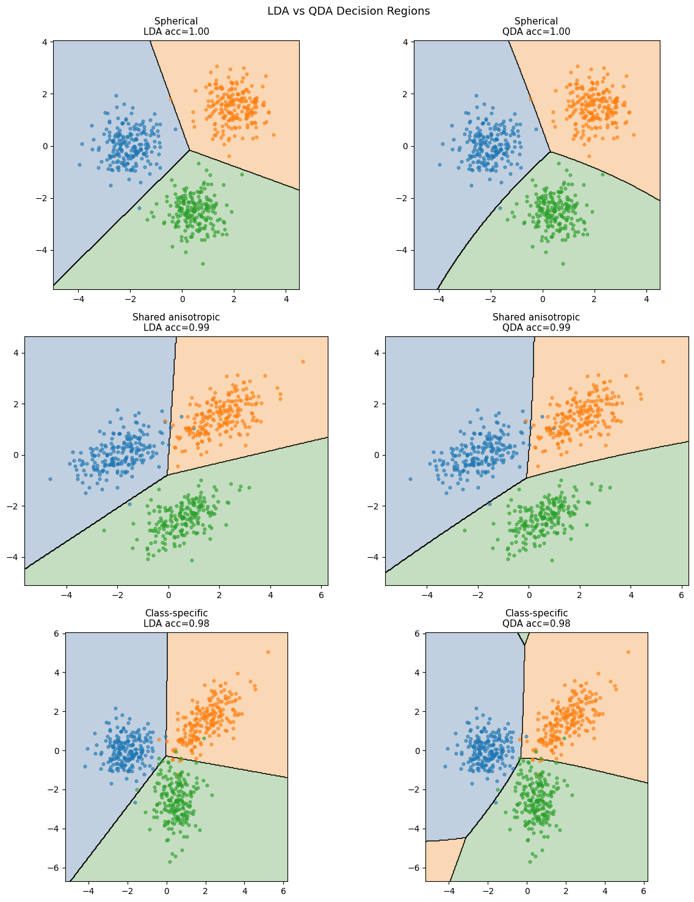](python/lda-qda/lda-qda.ipynb) | [](https://colab.research.google.com/github/gpeyre/mathematical-nexus/blob/main/python/lda-qda/lda-qda.ipynb) |
| **Legendre-Fenchel Transform**<br>Computes convex conjugates via the Legendre-Fenchel transform; illustrates subdifferentials, the bidual theorem, and inf-convolution as a Minkowski sum. | [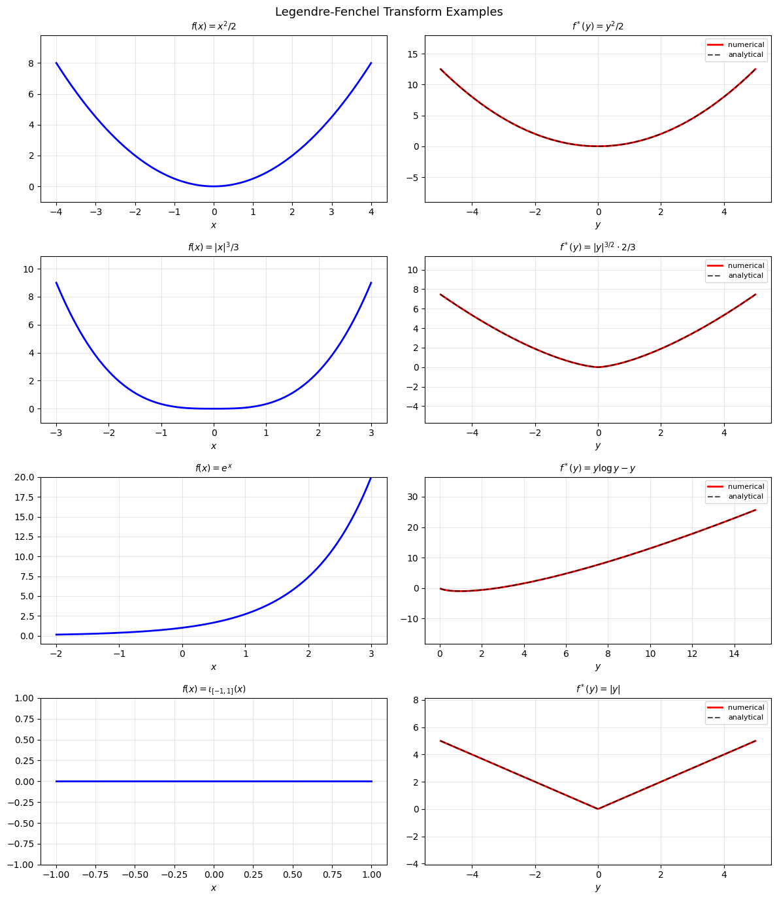](python/legendre/legendre.ipynb) | [](https://colab.research.google.com/github/gpeyre/mathematical-nexus/blob/main/python/legendre/legendre.ipynb) |
